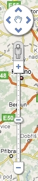

<!--
title : Nové ovládání Google Maps
author : Roman Ožana <ozana@omdesign.cz>
date : 26.11.2008 19:58:16
tags : google, mapy
-->

# Nové ovládání Google Maps

  

Google Maps upravil hlavní ovládací prvek [svých map][1]. Ten je teď momentálně mnohem více podobný Google Earth. Novinkou je postavička, která aktivuje [Street View][2]. Střední packa (hand) slouží k návratu na původní místo pohledu.

  Změny doznalo také ovládání Street View, je samozřejmě podobné tomu, jaké mají 2D mapy.

  Když už jsme u toho 3D pohledu na svět a Google Earth, server <a title="360 Cities" href="http://www.360cities.net/">360Cities</a> je nově plně propojen s Google Earth. Takže se můžete rozhlížet nejen po ulicích, ale také po městech a místech.

  No a jedna drobnost na závěr, šipkou, která se nachází vpravo dole, můžete otevřít náhledové okno.

 [1]: http://maps.google.cz/ "Google Maps"
 [2]: http://maps.google.com/help/maps/streetview/ "Street View"