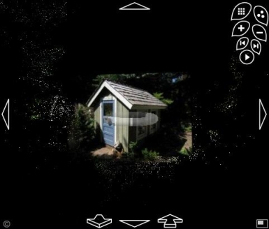

<!--
title : Photosynth vloží vaše fotky do 3D
author : Roman Ožana <ozana@omdesign.cz>
date : 21.8.2008 07:34:06
tags : software
-->

# Photosynth vloží vaše fotky do 3D

Včera Microsoft spustil **dlouho očekávaný** produkt [Photosynth][1], který byl vyvíjen pod hlavičkou [LiveLabs][2] od roku 2006. Tento program dokáže z fotografií, nafocených běžným fotoaparátem, vytvořit virtuální 3D prostředí.

  

Jednotlivé fotografie jsou pospojovány do větších celků, na základě **podobnosti objektů**, které zachycují. Tyto celky jsou pak rozmístěny do prostoru tak, aby se jimi dalo procházet, jako v reálném světě. Celistvost a návaznost 3D prostředí závisí pouze na tom, jak moc fotogafií bylo v oblasti pořízeno.

O nahrání fotografii na server se stará desktopová aplikace Photosynth ([ke stažení zde][3]). Tato aplikace současně obsahuje rozšíření, které umožňuje prohlížení 3D světů přímo ve webovém prohlížeči.

Každý uživatel dostal do vínku **20 GB prostoru** pro své fotografie. Vše spolupracuje s [identitou Live ID][4], takže se nikde nemusíte znovu registrovat &#8211; stačí se jen přihlásit.

Současná verze Photosynth má několik omezení:

  * Všechny fotografie se nahrávají na server &#8211; což může někdy trvat pěkně dlouho
  * Veškeré vytvořené 3D světy jsou přístupné Online všem bez rozdílů &#8211; nelze vytvořit privátní svět
  * Jediné podporované operační systémy Vista a XP
  * No a samozřejmě nutnost mít zaregistrované Live ID

Více se můžete dozvědět na [Photosynth.net][5] nebo v [v tomto PDF][6].

 [1]: http://photosynth.net/ "Oficiální stránky PhotoSynth"
 [2]: http://livelabs.com/ "Live Labs"
 [3]: http://photosynth.net "Stránky Photosynth"
 [4]: https://accountservices.passport.net/ "Live ID Identita"
 [5]: http://photosynth.net/ "Photosynth.net - oficiální stránky programu"
 [6]: http://photosynth.net/documentation/Photosynth%20Guide%20v6b_CC.pdf "Návod pro ovládání Photosynth"