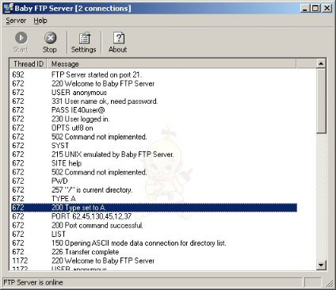

<!--
title : Pohotový FTP server
author : Roman Ožana <ozana@omdesign.cz>
date : 20.2.2008 09:46:33
tags : software
-->

# Pohotový FTP server

V dnešní uspěchané době je čas tím nejpodstatnějším! Některé šikovné aplikace Vám jej dokážou ušetřit. Úžasným příkladem může být například pohotovostní FTP server. Dobré zkušenosti mám s [Baby FTP][1].

  

**Co Baby FTP umí?**

  * Anonymní přístup
  * Přístup do jedné složky
  * Real time logování přístupu na sever
  * Automatický start po spuštění systému
  * Nastavení práv (mazání, stahování, vytváření)

**Jak Baby FTP zprovozníte?**  
Velmi snadno &#8211; stačí pouze spustit soubor babyftp.exe. Nezapomeňte v nastavení zvolit domovskou složku a práva přístupu. Nemusím zdůrazňovat, že díky jeho velikosti jej můžete mít stále u sebe na svém USB disku. Můžete si tak zprovoznit FTP server prakticky kdekoliv.

Těm paranoidním z nás bych doporučil [Core SFTP mini server][2], který podporuje šifrované přenosy.

 [1]: http://www.pablosoftwaresolutions.com/html/baby_ftp_server.html "Baby ftp server"
 [2]: http://www.coreftp.com/ "Core SFTP mini server"