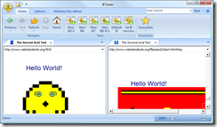

<!--
title : 5 zajímavých SW
author : Roman Ožana <ozana@omdesign.cz>
date : 16.7.2009 07:52:18
tags : how-to, software
-->

# 5 zajímavých SW

První zajímavý software nese jméno <a href="http://www.my-debugbar.com/wiki/IETester/HomePage" target="_blank">IE Tester</a>. Jak název napovídá, slouží pro testování www stránek pro starší Internet explorery.

[][1]

Nešvarem tohoto programu je **velká nestabilita**. Dalo by se říct, že kopíruje Internet explorer skute�ně věrně.

Druhý program, <a href="http://www.flashdevelop.org/" target="_blank">FlexDevelop</a>, ocení **vývojáři Flex a Flash** aplikací Je to jedno z mála použitelných vývojových prostředí pro tyto aplikace, které je dostupné zdarma. Jeho funkcionalitu je možné vylepšit prostřednictvím <a href="http://www.flashdevelop.org/wikidocs/index.php?title=3rd_Party_Plugins" target="_blank">několika pluginů</a>.

Třetí program se jmenuje <a href="http://www.xmind.net/" target="_blank">XMind</a> a slouží k vytváření [myšlenkových map][2]. Jeho prostředí je postaveno na Eclipse, ale navzdory tomu je celkem **rychlý** a uživatelsky velmi přívětivý.

O �tvrtém programu jsem [psal nedávno][3]. Jmenuje se <a href="http://www.fbackup.com/" target="_blank">FBackup</a> a slouží k **zálohování souborů** na disku.

Poslední program vám pomůže **zvýšit bezpe�nost** vašeho po�íta�e. Jmenuje se <a href="http://www.iobit.com/advancedwindowscareper.html" target="_blank">Advanced SystemCare</a>a nabídne Vám snadnou a rychlou optimalizaci a opravu Windows. Pomoci jediného kliknutí můžete imunizovat svůj po�íta�, vy�istit registry, smazat nepotřebné soubory a odstranit spyware.

 [1]: image.png
 [2]: http://www.nabito.net/tvorime-myslenkove-mapy/
 [3]: http://www.nabito.net/nejlepsi-zalohovac-toucan-nebo-fbackup/