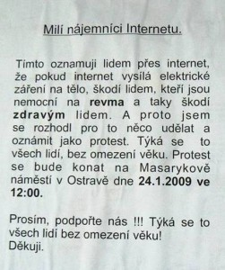

<!--
title : Ostrava: Demonstrace proti Internetu
author : Roman Ožana <ozana@omdesign.cz>
date : 21.1.2009 13:09:46
tags : internet
-->

# Ostrava: Demonstrace proti Internetu

Milí nájemníci Internetu, v Sobotu 24.1.2009 ve 12:00 se bude v Ostravě na Masarykově náměstí konat **protest proti Internetu**. Protože Internet způsobuje **revma a vůbec škodí zdraví lidí.** Tohle oznámení, určené _lidem přes internet_ najdete teď v centru Ostravy (díky za foto Honzo).

  

Osobně se tam vypravím jako zástupce druhé strany (onen [člověk přes Internet][1]). Pokud se někdo **chce přidat**, pošlete tuto informací dál, budu jedině rád. Samozřejmě se moje výzva také týká lidí bez omezení věku :-).

 [1]: http://www.omdesign.cz "Člověk přes internet"