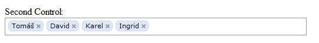

<!--
title : Facebook like multiselect pomocí jQuery
author : Roman Ožana <ozana@omdesign.cz>
date : 9.10.2009 12:00:41
tags : facebook, jquery
-->

# Facebook like multiselect pomocí jQuery

Líbí se Vám, jak má Facebook vyřešený výběr většího počtu položek?

Chcete něco podobného, pak **doporučuji** stáhnout rozšíření pro [jQuery][1] jménem [FCBKcomplete][2]. Obdobných pluginů existuje několik, ale tento je dle mého názoru **nejlepší**. Snadno se integruje do existujících formulářů. Facebook like výběr je totiž možné vytvořit z libovolného [multiselectu][3].

<pre>$("element").fcbkcomplete({
json_url: "fetched.txt",
json_cache: true,
filter_case: true,
filter_hide: true,
newel: true
});
</pre>

 [1]: http://jquery.com/ "jQuery"
 [2]: http://www.emposha.com/javascript/fcbkcomplete.html "FCBKcomplete v 2.6."
 [3]: http://www.w3schools.com/tags/tag_select.asp "Select"