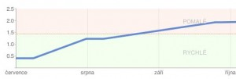

<!--
title : Google měří rychlost vašeho webu
author : Roman Ožana <ozana@omdesign.cz>
date : 3.12.2009 09:28:48
tags : chrome, google, webdesign
-->

# Google měří rychlost vašeho webu

Google přidal do [webmaster tools][1] další funkci. Tato funkce se zatím ukrývá v Laboratoří Google pod názvem **Výkon webu**. Dominantou této funkce je graf vývoje rychlosti Vašeho webu. Než se podíváte na to jak rychlé jsou Vaše stránky doporu�uji prostudovat, co je to [percentil][2]. Hodnota 20 percentilu rychlostí všech sledovaných webů je totiž oním zlomem, který od sebe dělí rychlé a pomalé stránky.

[][3]

Tato funkce samozřejmě není samoú�elná. **Rychlost na�ítání webu** může totiž být velmi hezky zahrnuta do **algoritmu** pro řazení výsledků [vyhledáva�e][4]. Skoro se mi až chce napsat: Na velikosti možná nezáleží :), ale na [rychlosti na�ítání rozhodne][5]. Nová funkce rovněž koresponduje ze snahou Google [zrychlit internet][6]. Google bojuje za rychlost na všech frontách:

  * uvolnil skvělý [rychlý prohlíže� Chrome][7]
  * pracuje na [vlastním rychlém opera�ním systému][8]
  * [hostuje Javascript knihovny][9] na svých serverech
  * uvolnil plugin do Firefox pro měření rychlosti

 [1]: http://www.google.com/webmasters/ "Webmaster Central"
 [2]: http://cs.wikipedia.org/wiki/Percentil "Percentil"
 [3]: rychlost-webu.jpg
 [4]: http://www.google.cz/ "Google :)"
 [5]: http://www.nabito.net/zrychlujeme-nacitani-stranek/ "Zrychlujeem na�ítání stránek"
 [6]: http://code.google.com/intl/cs/speed/page-speed/ "Page Speed"
 [7]: http://www.google.com/chrome "Chrome"
 [8]: http://www.chromium.org/chromium-os "Chrome OS"
 [9]: http://code.google.com/intl/cs/apis/ajaxlibs/ "AJAX Libs"