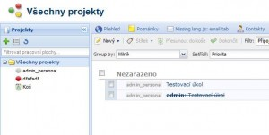
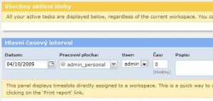

<!--
title : Otestováno: OpenGoo
author : Roman Ožana <ozana@omdesign.cz>
date : 5.10.2009 06:00:57
tags : ExtJS, OpenGoo, opensource, PHP
-->

# Otestováno: OpenGoo

Včera večer jsem otestoval aplikaci [OpenGoo][1]. Webová aplikace OpenGoo je určena všem, kteří potřebují spolupracovat, **zvyšovat produktivitu** a pohodlně **komunikovat** v rámci týmu a mimo něj. Prostřednictvím je možné například:

  * Spravovat úkoly (TODO list), přidělovat úkoly, stanovovat milníky atd.
  * Sdílet dokumenty (upload, editace)
  * Ukládat kontakty (na zákazníky nebo organizace)
  * Číst nebo napsat e-mail (včetně Google Apps)
  * Sdílet odkazy na internetové stránky
  * Sdílet poznámky a komentáře
  * Spravovat svůj tým
  * Fakturovat zákazníky, ukládat časy atd.
 

Celá aplikace je dostupná v několika jazycích, mimo jiné také v češtině, ale bohužel překlad není 100%. Část systému na Vás **stále mluví anglicky**.

Instalace systému probíhá zcela automaticky, prostřednictvím průvodce. Velikost zdrojových kódu je cca 22 MB. Než cokoliv začnete instalovat, koukněte se [na demo][7]. Současnou verzi OpenGoo 1.5.3 můžete [stahovat na SourceForge][8] zcela zdarma.<p

 [1]: http://opengoo.org/ "OpenGoo"
 [2]: http://www.extjs.com/ "ExtJS"
 [3]: http://cs.wikipedia.org/wiki/Model-view-controller "Co je to MVC"
 [4]: http://framework.zend.com/manual/en/zend.search.lucene.html "Zend Lucene"
 [5]: http://en.wikipedia.org/wiki/Textile_%28markup_language%29 "Texyle"
 [6]: http://php.opensourcecms.com/scripts/show.php?catid=4&cat=Groupware "Groupware"
 [7]: http://demo.opengoo.org/ "Demo"
 [8]: http://sourceforge.net/projects/opengoo/files/ "OpenGoo download"