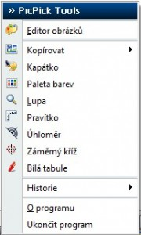

<!--
title : PicPick: nejen zachycení obrazovky
author : Roman Ožana <ozana@omdesign.cz>
date : 24.10.2009 06:45:16
tags : how-to, software
-->

# PicPick: nejen zachycení obrazovky

Programů pro **zachytávání obrazovky** je skutečně hodně. Bohužel valná většina z nich, vypadá jako nedodělané prvotiny **začínajících programátorů**. Těch užitečných a použitelných je opravdu málo. Jedním z nejlepších, alespoň podle mého názoru, je [PicPick][1].

[][2]

Stručný výčet vlastností:

  * podporuje **klávesové zkratky**, které si navíc můžete nastavit
  * dokáže **psát po obrazovce** (bílá tabule)
  * podporuje **automatické ukládání**
  * je v Češtině, alespoň z valné většiny
  * má kapátko, pravítko, zaměřovač, úhloměr a lupu
  * umí přímé kopírování do schránky

Navíc [PicPick][1] obsahuje vestavěný editor, ve kterém můžete své snímky **jednoduše upravit**, než je uložíte. Editor umí například změnit **velikost snímku**, vymazat některé části, oříznout snímek a podobně.

 [1]: http://picpick.wiziple.net/ "PicPick"
 [2]: http://picpick.wiziple.net/center