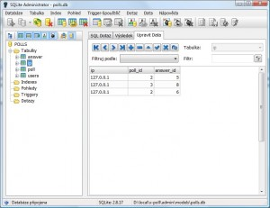

<!--
title : Skvělá admin aplikace pro SQLite
author : Roman Ožana <ozana@omdesign.cz>
date : 20.11.2009 14:24:27
tags : databaze
-->

# Skvělá admin aplikace pro SQLite

<a title="SQLite" href="http://www.sqlite.org/">SQLite</a> je malá a pohotová <strong>rela�ní databáze</strong>. Její podpora je zabudována do celé řady prostředí a programovacích jazyků. Přes svoji prťavost si SQLite dokáže poradit s <strong>většinou příkazů</strong> specifikovaných v <a title="SQL-92" href="http://en.wikipedia.org/wiki/SQL-92">SQL92</a>. Není postaveno na klasické client-server architektuře. Každá databáze je vměstnána do samostatném souboru.  Proto se velmi snadno přenáší. Poslední třešni�ka na dortu: SQLite je multiplatformní a opensource. Více o SQL najdete <a title="SQLite ultra lehké SQL" href="http://www.root.cz/clanky/sqlite-ultra-lehke-sql/">například na Root</a>.

Líbí se Vám? Pak jistě uvítáte odkaz na zajímavou a **užite�nou admin aplikaci** pro Windows. Jmenuje se jak jinak, než [SQLite admin][1].

[][2]<p

 [1]: http://sqliteadmin.orbmu2k.de/ "SQLite admin"
 [2]: sqlite-admin.jpg