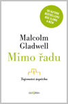

<!--
title : Třetí Malcolm Gladwell: Mimo řadu. Anatomie úspěchu.
author : Roman Ožana <ozana@omdesign.cz>
date : 21.11.2009 18:56:22
tags : Co čtu
-->

# Třetí Malcolm Gladwell: Mimo řadu. Anatomie úspěchu.

Nedávno u nás vyšla **třetí knížka** pozoruhodného autora [Malcolma Gladwella][1]. Jmenuje se [Mimo řadu. Anatomie úspěchu][2] a snaží se odpovědět na to, proč jsou **někteří úspěšní a jiní ne**. V první kapitole se například dočtete, jak je důležité **datum narození** pro Váš budoucí úspěch.

[][2]Pozn. Dvě **předešlé knížky** se jmenují [Bod zlomu][3] (2000) a [Mžik][4] (2005).

 [1]: http://en.wikipedia.org/wiki/Malcolm_Gladwell
 [2]: http://www.kosmas.cz/knihy/148819/mimo-radu-anatomie-uspechu/ "Mimo řadu. Anatomie úspěchu."
 [3]: http://www.kosmas.cz/knihy/130419/bod-zlomu/ "Bod Zlomu"
 [4]: http://www.kosmas.cz/knihy/131000/mzik-jak-myslet-bez-premysleni/