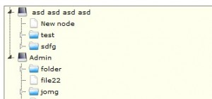

<!--
title : Šikovná stromová komponenta
author : Roman Ožana <ozana@omdesign.cz>
date : 30.5.2009 16:00:54
tags : jquery, programovani, webdesign
-->

# Šikovná stromová komponenta

[jsTree][1] je velmi šikovná [jQuery][2] (javascriptová) komponenta. Jak napovídá název, je tato komponenta ur�ena pro zobrazení stromové struktůry. Kromě prostého zobrazování, podporuje jsTree také přímou editaci stromu.

Strom je možné upravovat pomoci **přetahování** (drag & drop). Jednotlivé uzly se dají **přejmenovat**, přidávat nebo mazat (přes kontextovou nabídku). Vzhled komponenty můžete velmi pohodlně přizpůsobit svým potřebám. Vyměnit konky, změnit pozadí a podobně. Navíc komponentu můžete plně lokalizovat do rodného jazyka. jsTree je **odladěná** pro většinu běžných prohlíže�ů a připraven k použití.

Dost bylo dlouhého ře�nění zde jsou [příklady použití jsTree][3].

 [1]: http://code.google.com/p/jstree/
 [2]: http://jquery.com/ "jQuery"
 [3]: http://www.jstree.com/demo