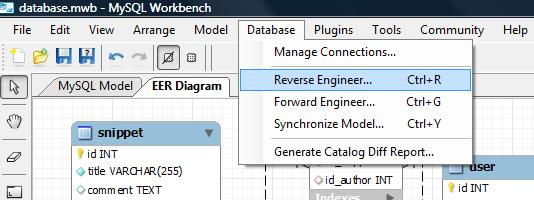

<!--
title : WOW efekt aneb MySQL Workbench OSS 5.1
author : Roman Ožana <ozana@omdesign.cz>
date : 25.9.2009 07:12:11
tags : databaze, mysql, programovani
-->

# WOW efekt aneb MySQL Workbench OSS 5.1

Tak nám, skoro nepozorovaně, vyšla **nová verze** skvělého nástroje [MySQL Workbench][1], na který jsem už [upozorňoval dříve][2]. MySQL Workbench je grafický nástroj pro návrh MySQL databází, který je vydáván ve dvou verzích. První verze (tzv. OSS) je dostupná zcela zdarma pod GPL licencí. Další je samozřejmě placená.

Až do současnosti byla OSS verze limitovaná ve smyslu **online spolupráce** s databází. Zjednodušeně řečeno, databázi jste si mohli navrhnout a poté vyexportovat do SQL souboru. Žádná synchronizace, žádné reverzní inženýrství &#8211; to uměla **pouze placená verze**. Tahle podstatná změna udělala z Wokbench OSS skutečnou **killer aplikaci** pro databáze MySQL.

**Představte si tu krásu**, něco změníte v ER diagramu a pak stisknete Ctrl+Y a vaše změny se propíšou do live databáze. Život už nemůže být jednodušší. Další neméně vychytanou funkcí je **reverzní inženýrství** &#8211; které Vám umožní získat ER diagram existující databáze. No jak říkám, život vývojáře už nemůže být jednodušší. Mezi drobnosti, které potěší, bych zařadil změna ikonek pro zadávání vazeb (konečně je tam napsáno 1:1, m:n a ne jen nic neříkající piktogram).

Takže [stahujte][3] a radujte se, stejně jako já.

 [1]: http://dev.mysql.com/workbench/ "MySQL Workbench"
 [2]: http://www.nabito.net/skvely-vizualni-nastroj-pro-mysql/ "Skvělý vizuální nástroj pro MySQL"
 [3]: http://dev.mysql.com/downloads/gui-tools/5.0.html