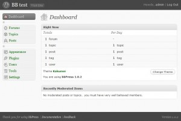

<!--
title : Znáte bbPress – diskuzní fórum od autorů WordPress
author : Roman Ožana <ozana@omdesign.cz>
date : 28.12.2009 10:41:10
tags : bbPress, mysql, PHP, programovani, test, wordpress
-->

# Znáte bbPress – diskuzní fórum od autorů WordPress

[bbPress][1] je webová aplikace pro správu a provoz **diskuzního fóra**. Byla vytvořena autory [Wordpress][2], což poznáte ihned po **přihlášení do administrace**. Ta totiž vypadá úplně stejně, jako administrace posledních verzí Wordpress. Provázání obou aplikací je zřejmé hned při instalaci. Instalátor nabízí možnost integrovat bbPress do [Wordpress][2]. Tuhle možnost jsem zatím nevyužil, ale někdy se to prostě může hodit.

[][3]

Co Vám bbPress nabídne:

  * jednoduchou **správu témat a příspěvků**
  * správu uživatel
  * snadnou lokalizaci, aplikaci je možné přeložit s využitím GNU [gettext][4]
  * podporu [GR avatar][5]
  * hezké URL
  * tagy u příspěvků
  * podporu pluginů &#8211; v základu můžete použít např. **Akismet** pro filtrovaní spamu
  * podporu template

Vyzkoušel jsem řadu klonů populárního [phpBB][6]. Žádný z nich si nezískal mé srdce tak rychle jako [bbPress][1]. Pokud uctíváte jednoduchost, rychlost a přehlednost je bbPress ur�en přímo Vám.

 [1]: http://bbpress.org/ "bbPress"
 [2]: http://wordpress.org/ "Wordpress"
 [3]: bbpress.jpg
 [4]: http://en.wikipedia.org/wiki/GNU_gettext "Gettext"
 [5]: http://en.gravatar.com/ "GRAvatar"
 [6]: http://www.phpbb.com/ "phpBB"