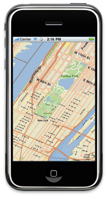
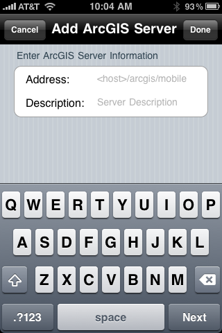

<!--
title : ArcGIS pro iPhone a iPad
author : Roman Ožana <ozana@omdesign.cz>
date : 8.7.2010 08:39:52
tags : ArcGIS, ESRI, iOS, iPad, iPhone
-->

# ArcGIS pro iPhone a iPad

[][1]

[[][1]

][2] vytvořilo mapovou aplikaci ArcGIS pro [iOS][3]. Tato aplikace umožňuje procházení mapových podkladů nebo kolekcí map ([ArcGis Online][4]) v terénu, sběr informací (editace atributů) a provádění základních analýz jako jsou například měření vzdálenosti, plochy nebo identifikace objektů.

Je dobré zmínit, že aplikace není omezena pouze na podklady v ArcGIS online Gallery, můžete se samozřejmě **přihlásit na vlastní ArcGIS server**. Bohužel jiná platforma než ESRI není aplikací podporována. Můžete tedy zapomenout na WMS, WFS a ostatní.

Přihlášení na vlastní ArcGIS server:

[][5]

ArcGIS pro iOS nabízí poměrně [zajímavé API][6] pro **tvorbu vlastních GIS aplikací pro iOS**. V současnosti je toto API v beta fázi do konce roku by však mělo být stabilní.

ArcGIS pro iOS zase o kousínek přiblížil den, kdy se GIS aplikace osvobodí ze sevření profesionálních zařízení a budou dostupné skutečně každému.

Zdroje:

  * [ArcGIS for iOS][7]
  * [ESRI][8]
  * [Browse & Share GIS Maps with New iOS App from ESRI][9]

 [1]: iphonemap.png
 [2]: http://www.esri.com/ "Environmental Systems Research Institute (ESRI)"
 [3]: http://en.wikipedia.org/wiki/IOS_(Apple) "iOS"
 [4]: http://www.arcgis.com/home/gallery.html "ArcGis online"
 [5]: arcgis-for-ios-esri-web-services.png
 [6]: http://resources.arcgis.com/content/arcgis-iphone/api
 [7]: http://www.spatiallyadjusted.com/2010/07/06/arcgis-for-ios-release/ "ArcGIS for iOS"
 [8]: http://resources.arcgis.com/content/arcgis-ios "ESRI"
 [9]: http://www.readwriteweb.com/archives/something_about_mapping_nerds_loving_arcgis_for_io.php "Browse & Share GIS Maps with New iOS App from ESRI"