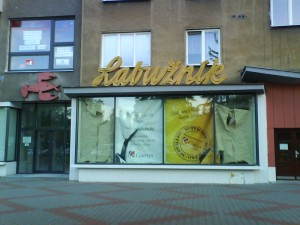
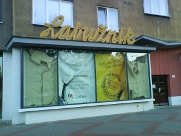

<!--
title : Bufet Labužník na Lenince – čest jeho památce
author : Roman Ožana <ozana@omdesign.cz>
date : 13.9.2010 08:41:40
tags : Historie, Labužník
-->

# Bufet Labužník na Lenince – čest jeho památce

Poslední klasický předrevoluční bufet na Hlavní třídě v Ostravě podlehl moderní době. Bude tam zřejmě kavárna, nebo něco podobného (možná že už je &#8211; fotky jsou starší).

  

Čest jeho památce a nejlepší **dršťkové polévce** za dvacku, plastovým židličkám, odkládanému použitému nádobí, točené Kofole, co asi není Kofola. Zákuskům, chlebíčkům a podivným salátům, které jsem **nikdy neměl odvahu ochutnat**.