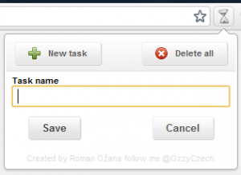

<!--
title : Chrome Time Track
author : Roman Ožana <ozana@omdesign.cz>
date : 6.12.2010 14:23:23
tags : chrome, google, HTML5, javascript, jquery, Rozšíření
-->

# Chrome Time Track

Vydal jsem druhou verzi [Chrome Time Track][1] pro prohlíže� [Chrome][2]. Toto rozšíření Vám umožní snadno **sledovat �as strávený nad úkolem** nebo projektem.

Rozšíření **nevyžaduje připojení k internetu**. Pro ukládání �asů a úkolů využívá [lokální databázi][3] (HTML 5). Čas měří i **při zavřeném prohlíže�i**! Rozšíření si totiž zapamatuje poslední kliknutí na play a předchozí strávený �as. Snadno jej tak dopo�ítá. Je rovněž možné sledovat několik úloh najednou, nebo případně upravit �as ru�ně. Pokud Vám cokoliv bude chybět, pošlete [požadavek][4] na [GitHub][5], kde rovněž najdete zdrojový kód.

Inspirací pro sepsání tohoto rozšíření byl  [jTrack][6].

 [1]: https://chrome.google.com/extensions/detail/hbhcgdpbdenjjpekdajanfgchlgacdea
 [2]: http://www.google.com/chrome
 [3]: http://www.w3.org/TR/webdatabase/
 [4]: https://github.com/OzzyCzech/Chrome-Time-Track/issues
 [5]: https://github.com/OzzyCzech/Chrome-Time-Track
 [6]: http://bulgaria-web-developers.com/projects/javascript/jtrack/