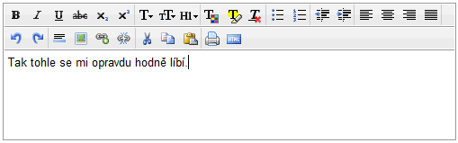

<!--
title : CLEditor – fajný WYSIWYG HTML Editor
author : Roman Ožana <ozana@omdesign.cz>
date : 13.8.2010 05:09:36
tags : jquery, plugin, WYSIWYG
-->

# CLEditor – fajný WYSIWYG HTML Editor

<a title="CLEditor" href="http://premiumsoftware.net/cleditor/" target="_blank">CLEditor</a> je zajímavý HTML WYSIWYG editor postavený nad knihovnou  [jQuery][1]. Proti konkurenci (např. [TinyMCE][2], [CKeditor][3]) v něm spatřuji několik výhod:

  * nemá zbyte�ně moc funkcí
  * je rychlý a malý (celkově méně než 10 K dat)
  * bleskově se na�ítá
  * snadno [se používá][4]
  * podporuje vkládání tabulek (pomocí pluginu)
  * MIT licence

Co bych ještě uvítal?

  * lepší rozhraní pro vkládání obrázků
  * možnost překladu rozhraní (dá se pouze v kódu)
  * vložit z Wordu / vložit neformátovaný text a odstranit formátování

Editor spolupracuje s jQuery 1.4.2 a byl otestován na IE 6.0+, FF 1.5+, Safari 4+, Chrome 5+ and Opera 10+. Editor můžete stahovat z [Google Code][5] nebo ze [stránek autora][6].

 [1]: http://jquery.com/ "jQuery"
 [2]: http://tinymce.moxiecode.com/
 [3]: http://www.fckeditor.net/
 [4]: http://premiumsoftware.net/cleditor/docs/GettingStarted.html "Getting Started"
 [5]: http://code.google.com/p/cleditor/ "CLEditor"
 [6]: http://premiumsoftware.net/cleditor/ "CLEditor"