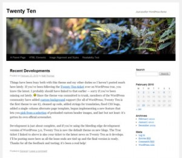

<!--
title : Co bude nového ve WordPress 3.0
author : Roman Ožana <ozana@omdesign.cz>
date : 26.2.2010 08:54:38
tags : programovani, wordpress
-->

# Co bude nového ve WordPress 3.0

[Wordpress][1] je zřejmě **nejoblíbenější** systém pro správu blogů. Což dokazuje nejen široká uživatelská komunita, ale také pravidelné vydávání update. V květnu se do�káme třetí verze. Co tahle verze přinese?

První **důležitou změnou** budou **volitelné typy příspěvků**. Tato změna Wordpress posune zase o kousek blíž ke **klasickému CMS**. Tato funkce Vám usnadní tvorbu různých seznamů, portfolii a podobně. Kone�ně tak odpadne složité filtrování a obcházení přes ID kategorii. Podívejte se na [Náhled nových příspěvků][2].

Do jádra aplikace se přesune [Plugin pro konfiguraci menu][3]. Menu si tak budete kone�ně moci organizovat dle libosti.

Třetí a **velmi zásadní změnou** bude nové defaultní téma. Které nese poetický název [Twenty Ten][4] (2010). Cílem je mít **každý rok novou verzi** defaultního vzhledu Wordpress. Náhled tohoto vzhledu najdete zde [http://2010dev.wordpress.com][5].

[][5]Další kosmetickou změnou bude možnost definovat vlastní template [pro každého autora][6]. Dále bude možné **zvolit jméno administrátora** při instalaci systému. Nestandardní jméno administrátora totiž zvýší **bezpe�nost Vašeho blogu**. Vypadá to, že se máme na co těšit. Co myslíte?

 [1]: http://wordpress.org/ "Wordpress"
 [2]: http://wpengineer.com/impressions-of-custom-post-type/
 [3]: http://www.woothemes.com/2010/01/the-awesome-custom-woo-navigation/ "Custom Navigation"
 [4]: http://2010dev.wordpress.com/ "2010"
 [5]: http://2010dev.wordpress.com/
 [6]: http://wpengineer.com/wordpress-3-0-specific-author-templates/