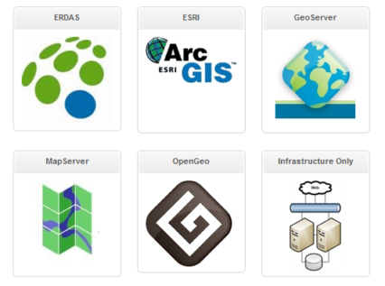

<!--
title : GIS aplikace v cloudu – stačí už jen pronajmout
author : Roman Ožana <ozana@omdesign.cz>
date : 18.6.2010 08:52:01
tags : app, ArcGIS, GIS
-->

# GIS aplikace v cloudu – stačí už jen pronajmout

Společnost [SkyGone][1] začala provozovat na svém počítačovém [obláčku][2] pohodlná řešení (deployment) pro nejznámější serverové aplikace. Na stránkách [The GIS Market Place][3] jich v současnosti najdete pět (některé jsou pravda ještě v přípravě). Konkrétně se jedná [Erdas][4], [ArcGis][5], [GeoServer][6], [MapServer][7] a [OpenGeo][8].

[][3]

Tyto klenoty samozřejmě **nezískáte zdarma**. Server si můžete pronajmout minimálně na měsíc. Konkrétně v případě serveru se rozpětí pohybuje od 225 USD do zhruba 675 USD měsíčně. Celkovou cenu může také ovlivnit zakoupený výkon. Například za 2 TB prostoru si připlatíte 500 USD navíc.<p

 [1]: http://www.skygoneinc.com/ "SkyGone"
 [2]: http://en.wikipedia.org/wiki/Cloud_computing "Cloud Computing"
 [3]: http://www.thegismarketplace.com/
 [4]: http://goo.gl/da5K "Erdas image server"
 [5]: http://goo.gl/galH "ArcGis Server"
 [6]: http://geoserver.org/ "GEoServer"
 [7]: http://mapserver.org/ "MapServer"
 [8]: http://opengeo.org/ "OpenGeo"