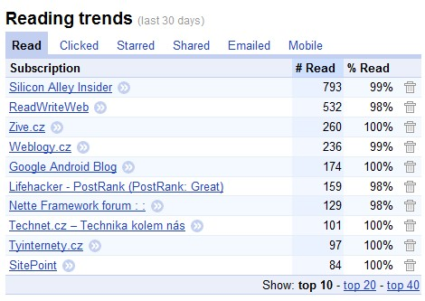

<!--
title : Informa�ní přetížení a Google Reader
author : Roman Ožana <ozana@omdesign.cz>
date : 11.9.2010 13:38:14
tags : Google Reader, RSS
-->

# Informa�ní přetížení a Google Reader

[Google Reader][1] je skvělá aplikace, která Vám snadno **sežere spoustu �asu**. Pokud sledujete větší množství zdrojů, může snadno dojit k **informa�nímu přetížení**. **Informa�ní přetížení** je stav, při kterém �lověk už není schopen efektivně zpracovávat další informace. Stru�ně ře�eno se v tom topí. Ruku v ruce s tímto stavem pocit frustrace.

Tento negativní stav má obvykle horší průběh, když se nejedná o takovou &#8220;srandu&#8221; jako je Google Reader. Hromada nezpracovaných pracovních e-mailů, každý z nich [dlouhý jako 14 dní][2] v kombinaci s �asovou tísní &#8211; to je teprve **kvalitní pocit frustrace** ([Tips For Dealing With Information Overload][3]).

Ale zpět k [Google Reader][1] a tomu, jak řešit informa�ní přetížení. V prvním kroku je nutné zjistit, **co Vás vlastně přetěžuje**, který ze sledovaných zdrojů na Vás chrlí jeden �lánek za druhým. K tomuto zjištění Vám posta�í sám [Google Reader][1]. V levém menu sta�í kliknout na **Trends** (používám anglickou verzi).

V mém případě je **největším zásobovatelem** [Silicon Alley Insider][4] a [ReadWriteWeb][5]. Oba tyto servery mají za posledních 30 dní na svědomí přes 1000 příspěvků. Skute�ně **užite�ných bylo pár �lánků** &#8211; což z nich �iní kvalitní kandidáty pro filtrování obsahu.

Pro **filtrování** jsem zvolil aplikaci [PostRank][6], který dokáže filtrovat pouze kvalitní (úspěšné) příspěvky. Filtrování probíhá na základě ukazatelů získaných ze sociálních sítí ([Google Chrome Addon][7]). Další možností je filtrovat �lánky **na základě výskytu klí�ových slov**. Tady Vám může pomoci například [Pipes][8] nebo [FeedRinse][9]. Případně si můžete napsat něco vlastního: <http://github.com/dg/rss-php>.

 [1]: http://www.google.cz/reader/view/ "Google Reader"
 [2]: http://twitter.com/eastbiz/status/23983257756
 [3]: http://goo.gl/VRDo
 [4]: http://www.businessinsider.com/sai
 [5]: http://www.readwriteweb.com/
 [6]: http://www.postrank.com
 [7]: http://goo.gl/WhQW
 [8]: http://pipes.yahoo.com/pipes/
 [9]: http://www.feedrinse.com/