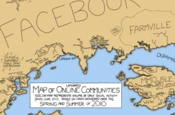

<!--
title : Mapa sociálních sítí
author : Roman Ožana <ozana@omdesign.cz>
date : 8.10.2010 06:30:33
tags : facebook, mapa, Sociální sítě, twitter
-->

# Mapa sociálních sítí

Server [mashable.com][1] uveřejnil tři [mapy sociálních sítí][2]. První z nich ukazuje sociální svět v roce 2007 další o tři roky později.

[][2]Na první mapce z roku 2007 je jen malou zemiÄ�kou pod impériem [MySpace][3]. Na aktuální mapÄ› to je naopak. Hezky je na mapÄ› vidÄ›t nástup [Twittru][4].

 [1]: http://mashable.com/
 [2]: http://mashable.com/2010/10/06/map-online-communities/
 [3]: http://www.myspace.com/
 [4]: http://twitter.com/