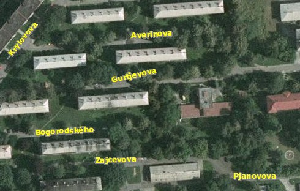
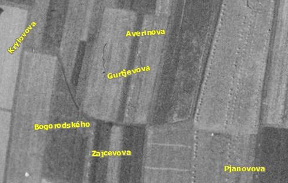
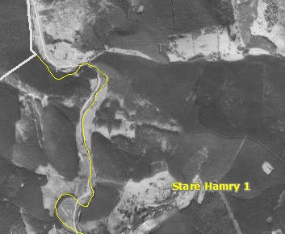
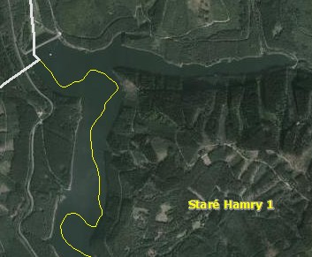

<!--
title : Naše krajina v 50 letech minulého století
author : Roman Ožana <ozana@omdesign.cz>
date : 17.6.2010 12:54:12
tags : mapa
-->

# Naše krajina v 50 letech minulého století

CENIA publikovala unikátní **historickou ortofoto mapu** ČR, která je výsledkem digitálního zpracování celoplošného leteckého snímkování z 50. let 20. století a �áste�ně i z let 1937–1938 (zdroj. [http://goo.gl/wcFq][1] a [http://goo.gl/A5LM][2]).Tak to u nás vypadá dnes:

[][3]

Ale dřív tady bylo hezké pole:

[][4]Tady taky dřív nebylo skoro nic:

[][5]Zato dnes:

[][6]

Pokud máte podobné toulky minulostí rádi sta�í otevřít <http://kontaminace.cenia.cz/>

 [1]: http://goo.gl/wcFq "CENIA prezentovala historickou ortofotomapu ÄŒR"
 [2]: http://goo.gl/A5LM "Využití nové unikátní historické ortofotomapy ČR pro vyhledávání starých ekologických zátěží"
 [3]: g-new.jpg
 [4]: g-old.jpg
 [5]: sth-old.jpg
 [6]: sth-new.jpg