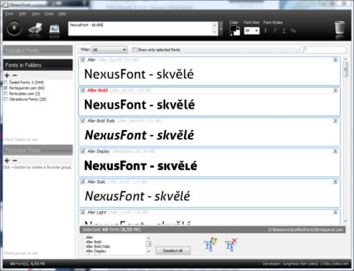

<!--
title : Pořádek ve fontech zajistí NexusFont
author : Roman Ožana <ozana@omdesign.cz>
date : 21.3.2010 17:04:13
tags : Fonty, Grafika, webdesign
-->

# Pořádek ve fontech zajistí NexusFont

[NexusFont][1] je velmi užitečný freeware manažer fontů**.** NexusFont Vám umožní:

  * instalaci/odinstalaci fontů (včetně zálohy)
  * mazání fontů
  * procházení nainstalovaných fontů
  * generování živých náhledů (příkladů)

Co do formátů NexusFont podporuje _TrueType_, _OpenType_ a _Adobe Type1_. Dále program dokáže **vyhledat duplicitní fonty**. Vytisknout, nebo exportovat náhledů na všechny znaky fontů.

Na webu [xiles.net][2] najdete kromě [NexusFont][1] také další zajímavé programy:

  * NexusFile &#8211; file manažer
  * NexusTextView &#8211; prohlížeč souborů
  * NexusImage &#8211; prohlížeč obrázků
  * NexusSide &#8211; sidebar ala Windows

 [1]: http://xiles.net/programs/ "NexusFont"
 [2]: http://xiles.net/programs/