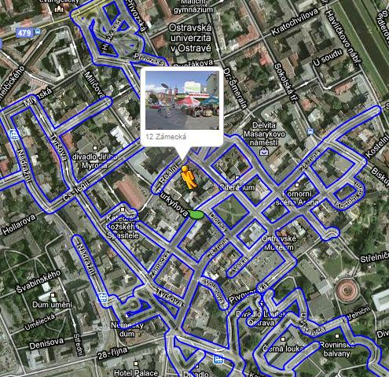

<!--
title : Tak Ostrava už taky Streetuje
author : Roman Ožana <ozana@omdesign.cz>
date : 12.3.2010 12:51:01
tags : google-maps, Ostrava
-->

# Tak Ostrava už taky Streetuje

**Centrum Ostravy** je konečně dostupné v Google [Street View][1]. Doufám, že to je pouze předvoj a ochutnávka. Koukněte na [Google Maps][2].

[][3]

 [1]: http://www.google.com/intl/en_us/help/maps/streetview/
 [2]: http://maps.google.com/maps?f=q&source=s_q&hl=en&geocode=&q=Ostrava&sll=49.792705,18.232887&sspn=0.011691,0.033023&ie=UTF8&hq=&hnear=Ostrava,+Czech+Republic&t=h&z=11 "OStrava"
 [3]: ostrava.jpg