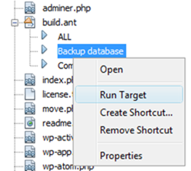

<!--
title : Automatizovaný dump MySQL databáze pomocí Apache ANT
author : Roman Ožana <ozana@omdesign.cz>
date : 11.1.2011 07:00:00
tags : ANT, netbeans, PHP
-->

# Automatizovaný dump MySQL databáze pomocí Apache ANT

Udělat dump databáze a nahradit všechen výskyt _localhost_ za novou adresu. Tohle musíte udělat vždy, když přenášíte instalaci **Wordpress** na produkční server – prostě pěkná otrava.

Následující [Apache Ant][1] skript to udělá za Vás:

<pre>&lt;?xml version="1.0" encoding="UTF-8"?&gt;
&lt;project basedir="."&gt;

  &lt;target name="Backup database"&gt;

    &lt;property name="database_name" value="mojedb"/&gt;

    &lt;mkdir dir="build" /&gt;

    &lt;exec dir="" executable="c:\Program Files\wamp\bin\mysql\mysql5.5.8\bin\mysqldump.exe"
    output="build/${database_name}_local.sql"&gt;
      &lt;arg line="--host=localhost" /&gt;
      &lt;arg line="-u root" /&gt;
      &lt;arg line="--password=" /&gt;
      &lt;arg line="--add-drop-table" /&gt;
      &lt;arg line="--default-character-set=utf8" /&gt;
      &lt;arg line="--complete-insert" /&gt;
      &lt;arg line="${database_name}" /&gt;
    &lt;/exec&gt;

    &lt;copy file="build/${database_name}_local.sql" tofile="build/${database_name}_server.sql"/&gt;

    &lt;replace file="build/${database_name}_server.sql" encoding="utf-8"&gt;
      &lt;replacetoken&gt;&lt;![CDATA[http://localhost]]&gt;&lt;/replacetoken&gt;
      &lt;replacevalue&gt;&lt;![CDATA[http://www.adresa.cz]]&gt;&lt;/replacevalue&gt;
    &lt;/replace&gt;

  &lt;/target&gt;

&lt;/project&gt;</pre>

Skript je samozřejmě nutné upravit pro své podmínky. Například změnit cestu k _mysqldump.exe_, zadat heslo (a login), přepsat jméno databáze atd.

Velkou výhodou je, že [Apache ANT][1] je možné integrovat přímo do [NetBeans][2] , spuštění tohoto skriptu je pak otázka jednoho kliknutí.

Ještě jedna drobnost, skript takto hezky spustíte jen v případě, že bude mít příponu _ant_.<p

 [1]: http://ant.apache.org/
 [2]: http://blogs.sun.com/netbeansphp/entry/ant_support_on_php_projects