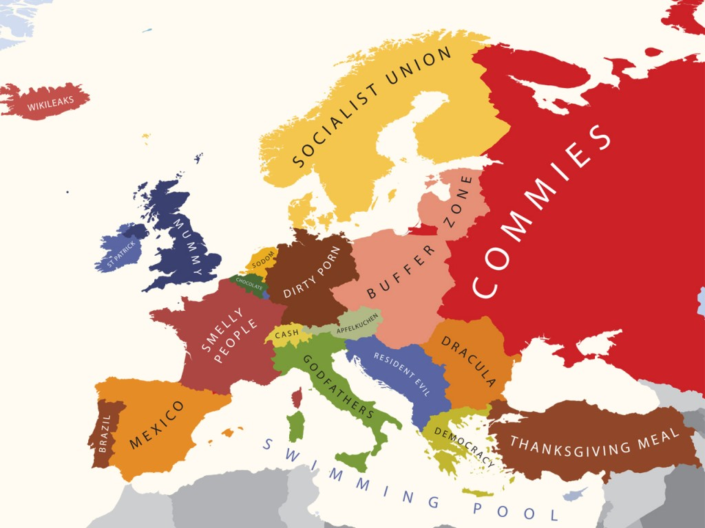

<!--
title : Mapové stereotypy
author : Roman Ožana <ozana@omdesign.cz>
date : 29.8.2011 18:10:26
tags : mapa
-->

# Mapové stereotypy

  Takhle nás vidí Ameri�ané? (<a href="http://www.brainpickings.org/index.php/2010/09/27/yanko-tsvetkov-mapping-european-stereotypes/">zdroj</a>) ostatní najdete <a href="http://alphadesigner.com/project-mapping-stereotypes.html">zde</a>

