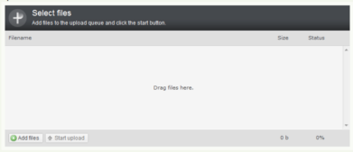

<!--
title : Plupload – všestranný král mezi upload pluginy
author : Roman Ožana <ozana@omdesign.cz>
date : 6.2.2011 19:25:46
tags : Flash, Gears, jquery, Obrázky, PHP, Silverlight, Upload
-->

# Plupload – všestranný král mezi upload pluginy

Skutečná všestrannost a **snadné použití**, jak pro uživatele, tak pro vývojáře. Díky tomu se pro mne stal [Plupload][1] králem mezi open source pluginy pro **nahrávání souborů na server**.

[][1]

[Plupload][1] podporuje nahrávání souborů s využitím technologie Flash, Google Gears, HTML 5, Silverlight, BrowserPlus nebo klasického HTML 4 formuláře. Počítáte správně – je to celkem 6 různých technologií!

Dále Pupload podporuje moderní **Drag/Drop upload souborů**, který používá například [Gmail][2]. Pokud nahráváte jpeg/png obrázky, je schopen je transformovat (zmenšit) ještě **před odesláním na server**. Poradí si také s většími soubory, které je schopen nahrávat po částech (chunking).

[Plupload][1] pochází z dílny autorů známého editoru [TinyMCE][3]. Zdrojové kódy naleznete na [GitHub][4].

 [1]: http://www.plupload.com/
 [2]: http://www.gmail.com
 [3]: http://tinymce.moxiecode.com/
 [4]: https://github.com/moxiecode/plupload