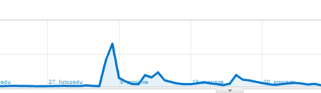

<!--
title : Rozšíření do Chrome a návštěvnost webu
author : Roman Ožana <ozana@omdesign.cz>
date : 25.2.2011 07:56:56
tags : chrome, Extension, Time Track
-->

# Rozšíření do Chrome a návštěvnost webu

Samochvála smrdí! Vytahování a chlubení se nepočítá žejo :-) Rozhodl jsem se pochlubit náhledem do návštěvnosti webu [omdesign.cz][1] po zveřejnění rozšíření [Chrome Time Track][2].

První opravdová **špička** nastala po uveřejnění rozšíření na serveru [lifehacker][3].&nbsp; Návštěvnost během jednoho dne vyskočila doslova neuvěřitelně nahoru (kdo by to čekal). Poté následovalo několik &#8220;záchvěvů&#8221; v podobě opsaných článků na jiných serverech.

Po uveřejnění samozřejmě vyskočil i počet instalací mého rozšíření, což potěšilo ještě víc. Všechny generované návštěvy mají pochopitelně hodně vysokou míru opuštění. Jsou to prostě návštěvy typu &#8220;kdo to vlastně napsal&#8221; – navíc je web jen v češtině.

Pevně doufám, že Vás tento článek namotivoval a taky nějaké to [rozšíření napíšete][4] – není to tak těžké, jak by se zdálo.

 [1]: http://www.omdesign.cz/
 [2]: https://chrome.google.com/webstore/detail/hbhcgdpbdenjjpekdajanfgchlgacdea
 [3]: http://lifehacker.com/#!5707433/chrome-time-track-eases-project-time-tracking
 [4]: https://github.com/OzzyCzech/Chrome-Time-Track