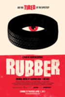
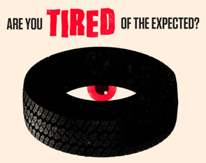

<!--
title : RUBBER movie
author : Roman Ožana <ozana@omdesign.cz>
date : 11.3.2011 11:29:06
tags : Movie, Rubber
-->

# RUBBER movie

1.4. (poetické) nás čeká premiéra filmu [RUBBER][1]. RUBBER je příběh neživé pneumatiky (Roberta), která byla opuštěna v poušti a náhle se **probudí k životu**. Zprvu se jen tak toulá krajinou a pak zjistí, že má netušené telepatické a telekinetické schopnosti. Dokáže zničit cokoliv chce! Jeho pozornost se brzo začne obracet k lidem.

O filmovou hudbu se postaral známý hudebník Mr. Oizo, který se proslavil v 90 letech singlem [Flat Beat][2]. Film má v současnosti něco kolem 4500 fanoušků na Facebooku! Jsem velmi zvědav, zda se v ČR tento film vůbec dostane do oficiální kino distribuce (pevně věřím, že bude jeho potenciál pochopen).

Vše mi tak trochu připomíná podobnou **filmařskou perlu,** která se pro změnu jmenuje [Black Sheep][3].

http://www.youtube.com/watch?v=joI-uU86NXw

http://www.youtube.com/watch?v=GN_qZKVrE9I

 [1]: http://www.rubberthemovie.com/
 [2]: http://www.youtube.com/watch?v=Kv6Ewqx3PMs
 [3]: http://www.youtube.com/watch?v=0gEDUDmZkyc