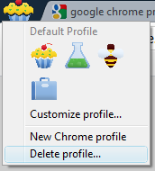
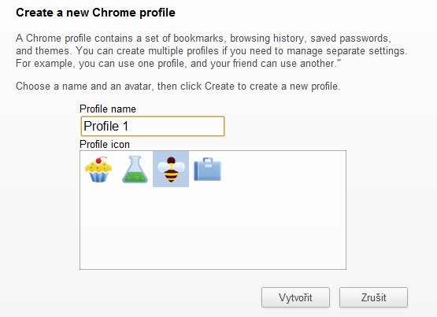

<!--
title : To si snad děláte pr*el: Google Chrome Profiles
author : Roman Ožana <ozana@omdesign.cz>
date : 19.7.2011 20:18:25
tags : chrome
-->

# To si snad děláte pr*el: Google Chrome Profiles

Další aktualizace [Google Chrome Dev][1] přinesla Chrome Profile. Profily mají pomoci zpřístupnit Chrome Browser na jednom po�íta�i více osobám.

[caption id="attachment_1643" align="aligncenter" width="172" caption="Na tohle raději neklikat!"][/caption]

  * Uživatelské profily se inspirují v [Chrome OS][2]
  * Zatím to pořádně nefunguje (prohlíže� padá a zasekává se)
  * Nedoporu�uji **mazat aktuální profil** (můžete přijít o synchronizaci ú�tu, bookmarky a rovněž Vám velmi pravděpodobně u tohoto procesu spadne prohlíže�)
  * Ikonky jsou **opravdu odporné** &#8211; ponechám stranou umístění v levém horním rohu aplikace a o�i tahající barevnost ikonek. Kam se poděl vkus.
  * Obrázky jsou jen �tyři &#8211; nahrát další zřejmě nejde &#8211; alespoň jsem to nikde nenašel
  * Profily není možné nikde vypnout

[caption id="attachment_1639" align="aligncenter" width="555" caption="VytvoÅ™ení nového Chrome Profilu"][/caption]

  Celkově vzato se tohle <strong>fakt moc nepovedlo</strong>. Sta�í si pro�íst diskuzi zde: <a href="http://goo.gl/6bM9h">http://goo.gl/6bM9h</a> namátkou jsem vybral:

> 

>   Oh my God I hate that damn cupcake. Please let us disable that—or at least let us have a reasonable icon, like the Chrome icon. One that doesn&#8217;t look like utter&#8230; well, crap.
> 

> 
> 

>   So now all my bookmarks are missing&#8230; I did not want this update. How do I get my bookmarks back? I need to get them back.
> 

> 
> 

>   The cupcake has to be one of the worst idea ever. Please, axe this!
> 

> 
> 

>   Who the hell thought that this cupcake thing is a good idea!? Here I thought that Google had finally learned how to design well with Google+ and then they come up with this utter disaster.
> 

> 
> 

>   bookmark gone&#8230;.i was expecting some confirmation when deleting profile&#8230;.but damn&#8230;&#8230;.
> 

> 
> 

>   </blockquote> 
>   
>   

>

 [1]: http://www.google.com/chrome?hl=cs
 [2]: http://www.youtube.com/watch?v=0QRO3gKj3qw