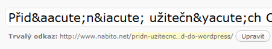
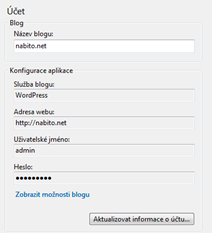

<!--
title : Windows Live Writer a čeština v titulku
author : Roman Ožana <ozana@omdesign.cz>
date : 7.2.2011 08:30:00
tags : how-to, Live Writer, wordpress
-->

# Windows Live Writer a čeština v titulku

[Windows Live Writer][1] defaultně escapuje české znaky v titulku příspěvků. To má za následek nejen hnusně vypadající titulek, ale hlavně chybně generovaný trvalý odkaz.

Chování [blogovacích klientů][2] ovlivňuje soubor [wlwmanifest.xml][3], který je standardní součástí Wordpress. Stačí jej upravit a přepnout přidat _requiresHtmlTitles_ jehož hodnota bude NO &#8211; odkaz na [dokumentaci][4].

<pre>...
&lt;options&gt;
  &lt;clientType&gt;WordPress&lt;/clientType&gt;
  &lt;supportsKeywords&gt;Yes&lt;/supportsKeywords&gt;
  &lt;supportsGetTags&gt;Yes&lt;/supportsGetTags&gt;
  &lt;requiresHtmlTitles&gt;No&lt;/requiresHtmlTitles&gt;
&lt;/options&gt;
...</pre>

Nezapomeňte znovu _Aktualizovat informace o účtu_ tlačítko se nachází v nastavení každého účtu:

 [1]: http://explore.live.com/windows-live-writer?os=other
 [2]: http://codex.wordpress.org/Weblog_Client
 [3]: http://core.trac.wordpress.org/browser/tags/3.0.4/wp-includes/wlwmanifest.xml
 [4]: http://msdn.microsoft.com/en-us/library/bb463260.aspx?ppud=4