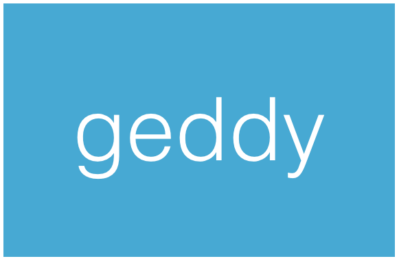

<!--
title : Geddy: simple, structured web framework for Node
author : Roman Ožana <ozana@omdesign.cz>
date : 13.12.2012 17:30:22
tags : app, controllers, database, EJS, Handlebars, Jade, models, mongodb, Mustache, MVC, Postgres, Riak, template, views
-->

# Geddy: simple, structured web framework for Node

Geddy is built on the same principles that many popular frameworks are based on. Every Geddy has its,, and as well as config files and routes.

### Supported engines

<li</li> <li</li> <li</li> <li</li> 

### Support

<li</li> <li</li> <li</li> 

  * in-memory

### Geddy provides

  * internationalization support out of the box, with localized error messages
  * built-in authentication
  * tons of useful utilities to make tasks easier, they are provided by the [utilities][1]Â module in NPM

http://geddyjs.org/ or https://github.com/mde/geddy

 [1]: http://geddyjs.org/documentation#utilities