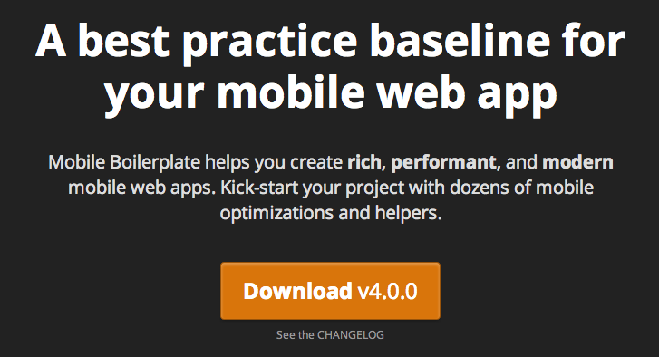

<!--
title : HTML 5 Mobile Boilerplate
author : Roman Ožana <ozana@omdesign.cz>
date : 16.11.2012 21:52:34
tags : link, responsive
-->

# HTML 5 Mobile Boilerplate

A best practice baseline for your mobile web app. [Mobile Boilerplate][1] helps you create rich, performant, and modern mobile web apps. Kick-start your project with dozens of mobile optimizations and helpers. Get source from [GitHub][2].

[][1]

&nbsp;

 [1]: http://html5boilerplate.com/mobile/
 [2]: https://github.com/h5bp/mobile-boilerplate