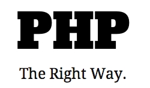

<!--
title : Linky na neděli #10
author : Roman Ožana <ozana@omdesign.cz>
date : 9.9.2012 08:00:59
tags : CSS, font, form, free, Generate, icons, javascript, jquery, PDF, PHP, validation
-->

# Linky na neděli #10

### Generate PDF from JavaScript

<pre>var doc = new jsPDF();
doc.text(20, 20, 'Hello world!');
doc.text(20, 30, 'This is client-side Javascript, pumping out a PDF.');
doc.addPage();
doc.text(20, 20, 'Do you like that?');

// Output as Data URI
doc.output('datauri');</pre>
 

### PHP The Right Way

There’s a lot of outdated information on the Web that leads new users astray, propagating bad practices and bad code. This must stop. _PHP: The Right Way_ is an easy-to-read, quick reference for PHP best practices, accepted coding standards, and links to authoritative tutorials around the Web. http://www.phptherightway.com

[][2]

### Typicons

[Typicons][3] are free-to-use vector icons embedded in a webfont kit for easy use in your UI, whether it be on the web or in a native application.

### Happy.js

[HappyJs][4] is lightweight for or [Zepto.js][5]. Download source from [GitHub][6].

### enquire.js

[enquire.js][7] is a lightweight, pure library for responding to media queries.

### SiteCake

http://sitecake.com &#8211;Â Simple, drag and drop CMS for fast editing. Watch The Trailer (1 minute)

http://www.youtube.com/watch?v=V6Oj4L_-LCY

 [1]: http://jspdf.com/
 [2]: http://www.phptherightway.com
 [3]: http://typicons.com
 [4]: http://happyjs.com
 [5]: http://zeptojs.com/
 [6]: https://github.com/andyet/Happy.js
 [7]: http://wickynilliams.github.com/enquire.js/