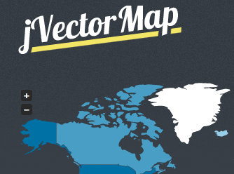

<!--
title : Linky na neděli #7
author : Roman Ožana <ozana@omdesign.cz>
date : 29.7.2012 13:00:09
tags : free, hosting, icons, javascript, Map, mongodb, PSD, tools, world
-->

# Linky na neděli #7

### jVectorMap: in

jVectorMap uses only native browser technologies like JavaScript, CSS, HTML, SVG or VML. No Flash or any other proprietary browser plug-in is required. This allows jVectorMap to work in all modern mobile browsers. Download from http://jvectormap.com/

### Mongo database hosting

Do you want use MongoDB-as-a-Service? Go to https://mongolab.com/home &#8211; they have Free plan with 500 mb

[][1]<p
 

### Mess

http://iconmonstr.com/ 600+ black

http://microjs.com/ &#8211; micro and frameworks

http://www.psdgraphics.com/ &#8211; free for download

 [1]: https://mongolab.com/welcome/