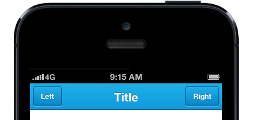

<!--
title : Prototype iPhone apps with simple HTML
author : Roman Ožana <ozana@omdesign.cz>
date : 7.11.2012 06:46:54
tags : applications, iPhone, link, mobile
-->

# Prototype iPhone apps with simple HTML

Prototype iPhone apps with simple HTML, CSS and JS components. http://maker.github.com/ratchet/Â See example:

<pre>&lt;header class="bar-title"&gt;
  &lt;a class="button" href="#"&gt;
    Left
  &lt;/a&gt;
  &lt;h1 class="title"&gt;Title&lt;/h1&gt;
  &lt;a class="button" href="#"&gt;
    Right
  &lt;/a&gt;
&lt;/header&gt;</pre>

<p
