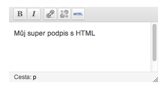

<!--
title : WYSIWYG pro popis uživatele ve WordPress
author : Roman Ožana <ozana@omdesign.cz>
date : 29.10.2012 12:33:04
tags : PHP, wordpress, WYSIWYG
-->

# WYSIWYG pro popis uživatele ve WordPress

Následující kratičký kód zobrazí editor u popisu autora u uživatelského profilu:

Kód stačí přidat do `function.php` ve vašem template:

<pre>&lt;?php
/**
 * WYSIWYG pro uzivatelsky profil Wordpress
 *
 * @author Roman Ozana &lt;ozana@omdesign.cz&gt;
 */
class CustomUserProfile {

	/** @var array */
	private $tinymceOptions = array(
		'teeny' =&gt; true,
		'quicktags' =&gt; false,
		'media_buttons' =&gt; false, 'textarea_rows' =&gt; 8,
		'wpautop' =&gt; false,
		'tinymce' =&gt; array(
			'theme_advanced_buttons1' =&gt; 'p, bold, italic, ul, |,link,unlink,code',
			'theme_advanced_buttons2' =&gt; '',
			'theme_advanced_buttons3' =&gt; '',
			'theme_advanced_buttons4' =&gt; '',
		),
	);

	public function __construct() {
		add_action('show_user_profile', array($this, 'initDescriptionWysywig'));
		add_action('edit_user_profile', array($this, 'initDescriptionWysywig'));
	}

	/**
	 * Wysywig editor take pro description
	 *
	 * @param $options
	 */
	public function initDescriptionWysywig($options) {
		if ( ! class_exists('_WP_Editors' ) )
			require_once( ABSPATH . WPINC . '/class-wp-editor.php' );

		$options = _WP_Editors::parse_settings('description', $this-&gt;tinymceOptions);
		_WP_Editors::editor_settings('description', $options);
		wp_print_styles('editor-buttons');
	}

}
new CustomUserProfile();</pre><p
