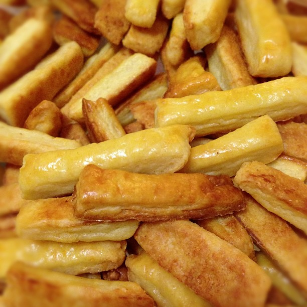

<!--
title : Zdroják na domácí sýrové ty�inky
author : Roman Ožana <ozana@omdesign.cz>
date : 5.12.2012 18:41:52
-->

# Zdroják na domácí sýrové ty�inky

Upozornění: ne�íst dál, recept může způsobit dlouhodobou závislosti na domácích sýrových ty�inkách :)

### Co budete potřebovat?

  * 16 dkg hladké mouky
  * 10 dkg Hery
  * 4 lžíce jemně strouhaného sýra (eidam)
  * 4 lžíce mléka
  * 10 g droždí (1/4 kostky)

### Postup

  Těsto se nenechává kynout! Rovnou se vyvaluje na cca 3 mm a krájí na ty�inky (5 až 7 krát 1 cm ty�inky) &#8211; nakrájené ty�inky na závěr potíráme rozšlehaným vejcem (kvůli lesku). Klademe vedle sebe na plech na pe�ící papír. Než ty�inky šoupnete do trouby tak je pořádně osolte. Pe�eme na 120 cca 12 minut do růžova.

### Výsledek vypadá lákavě ne?

[][1]

 [1]: a13bad003f0711e2af5a22000a9f18fb-7.jpg