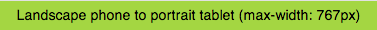

<!--
title : Debug responsive mixin for LESS CSS
author : Roman Ožana <ozana@omdesign.cz>
date : 22.3.2013 11:49:12
tags : CSS, debug, en, less, lesscss
-->

# Debug responsive mixin for LESS CSS

Add follow code to [main less][1] file:<pre { .debug(@text) { body:before { background: yellowgreen; display: block; padding: 5px; text-align: center; content: @text; } } }</pre> 

I have separate css rules for madia `max-width:767` screen in file  `responsive-767.less`. This file is inserted to main less by following line:

    @import "src-less/responsive-767"(max-width: 767px);

On the first line of `responsive-767.less` is<pre > .debug('Landscape phone to portrait tablet (max-width: 767px)');</pre> 

On the page with max-width 767 will show on top green debug banner:

There is generated CSS code:

<pre>@media (max-width:767px){body:before{background:yellowgreen;display:block;padding:5px;text-align:center;content:'Landscape phone to portrait tablet (max-width: 767px)';}</pre><p

 [1]: http://lesscss.org/