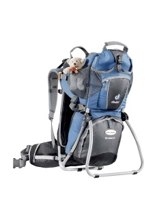

<!--
title : Půj�ovny krosni�ek na nošení dětí v Praze
author : Roman Ožana <ozana@omdesign.cz>
date : 12.7.2013 09:48:41
-->

# Půj�ovny krosni�ek na nošení dětí v Praze

Půj�ovny krosni�ek na nošení dětí **v Praze a blízkém okolí**

  * [s dětmi ven][1] &#8211; Praha 10 Uhříněves, 490 K� na týden a 2000 K� záloha
  * [Hudy Slezská][2] &#8211; Praha 2, cena 50 K� na den a 1000 K� záloha
  * [Hudy Havlí�kova][3] &#8211; Praha 1, Havlí�kova, cena 65 &#8211; 80 za den, záloha kolem 1500 K�

Na Hudy je sympatické, že obvykle dávají slevy při dlouhodobější vypůj�ce. Každá [pobo�ka][4] má jiný ceník.

 [1]: http://www.sdetmiven.cz/index.php
 [2]: http://praha-slezska.hudy.cz
 [3]: http://www.hudyhavlickova.cz/
 [4]: http://www.hudy.cz/kamenne-prodejny/outdoor-pujcovny.html