macOS neumí rozumný škálovaný rendering na nízkém DPI — vypadá dobře buď v **2× Retina** režimu, nebo špatně. Proto je pro Mac klíčové **~218 PPI**, což v praxi znamená **27" 5K** (5120 × 2880) nebo **32" 6K** (6016 × 3384 / 6144 × 3456). Vše ostatní je kompromis.

Řazeno od nejvhodnějšího po nejméně vhodné, uvnitř každé kategorie. Ceny jsou orientační **CZK** k srpnu 2026 — před nákupem ověřte aktuální SKU. Vynechány jsou modely starší než ~3 roky (tedy i [Pro Display XDR](https://www.apple.com/cz/pro-display-xdr/) z roku 2019).

## Proč 218 PPI

| Panel | Rozlišení | PPI | macOS |
|-------|-----------|-----|-------|
| 27" 5K | 5120 × 2880 | 218 | nativní 2× Retina, ostré |
| 32" 6K | 6016 × 3384 | 218 | nativní 2× Retina, ostré |
| 32" 6K (LG) | 6144 × 3456 | 224 | nativní 2× Retina, ostré |
| 27" 4K | 3840 × 2160 | 163 | škálované, měkčí text |
| 32" 4K | 3840 × 2160 | 140 | škálované, viditelné pixely |

## 27" 5K (218 PPI)

| Model | Panel / povrch | Jas | Kontrast | Gamut | Cena |
|-------|----------------|-----|----------|-------|------|
| Apple Studio Display XDR | mini-LED IPS / sklo nebo nano-texture | 1 000 nits SDR, 2 000 nits HDR | lokální stmívání (2 304 zón) | P3 + Adobe RGB | od 84&nbsp;990&nbsp;Kč |
| BenQ PD2730S | IPS / Nano Matte | 400 nits | 2 000:1 | 98 % DCI-P3, 100 % sRGB | od ~25&nbsp;190&nbsp;Kč |
| Apple Studio Display (2026) | IPS / sklo nebo nano-texture | 600 nits | nepublikován | P3 | od 42&nbsp;990&nbsp;Kč |
| Philips 27E3U7903 | IPS / antireflexní sklo | 500 nits (600 HDR) | 2 000:1 | 99 % DCI-P3, 99,5 % Adobe RGB | ~24&nbsp;990&nbsp;Kč |
| BenQ MA270S | IPS / Nano Gloss | 450 nits | 2 000:1 | 99 % DCI-P3, 99 % sRGB | od ~26&nbsp;480&nbsp;Kč |
| ViewSonic VP2788-5K | IPS / antireflexní 3H | 500 nits | 2 000:1 | 99 % DCI-P3 | od ~27&nbsp;659&nbsp;Kč |
| Asus ProArt PA27JCV | IPS / AGLR antireflexní | 400 nits (500 HDR) | 1 500:1 | 99 % DCI-P3, 95 % Adobe RGB | ~22&nbsp;990&nbsp;Kč |
| Asus ROG Strix XG27JCG | Fast IPS / antireflexní | 350 nits (600 HDR) | 1 000:1 | 97 % DCI-P3 | — |
| Samsung ViewFinity S8 S80HF | IPS | 350 nits | 1 000:1 | 99 % sRGB (bez P3) | — |

### Apple

**[Studio Display XDR](https://www.apple.com/cz/studio-display-xdr/)** — jediný 5K panel s opravdovým HDR: mini-LED podsvícení s 2 304 zónami, 1 000 nitů SDR a 2 000 nitů peak HDR, **120 Hz** s adaptivní synchronizací. Dva **Thunderbolt 5** (120 Gb/s) + dva USB-C 10 Gb/s, upstream TB5 dodává **140 W**. Sklo standardní, nebo nano-texture. Pozor: Macy s M1–M3 ho uživí jen na 60 Hz. Nejlepší obraz na trhu, cena tomu odpovídá. [Apple CZ](https://www.apple.com/cz/shop/buy-mac/studio-display-xdr) · [Heureka](https://monitory.heureka.cz/apple-studio-display-xdr-mfen4cs-a/)

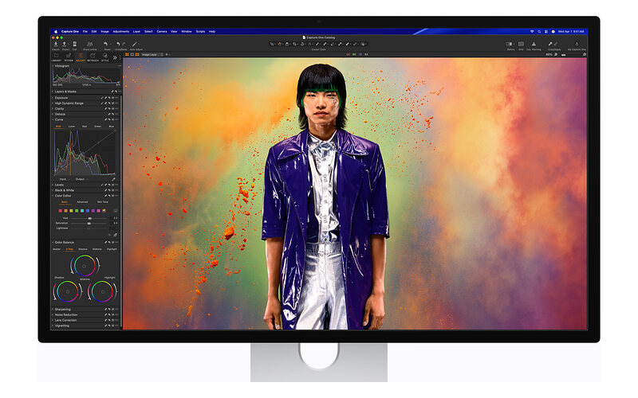

**[Studio Display (2026)](https://www.apple.com/cz/studio-display/)** — nejlepší integrace s macOS (jas z klávesnice, True Tone, 12MP kamera s Center Stage, šest reproduktorů), 600 nitů, P3, miliarda barev. Dva **Thunderbolt 5** + dva USB-C, **96 W** PD. Slabina je **60 Hz a žádné HDR** — proti roku 2022 přibyl v podstatě jen Thunderbolt 5. Nano-texture verze výrazně srazí odlesky za cenu mírně zrnitějšího obrazu. [Apple CZ](https://www.apple.com/cz/shop/buy-mac/studio-display)

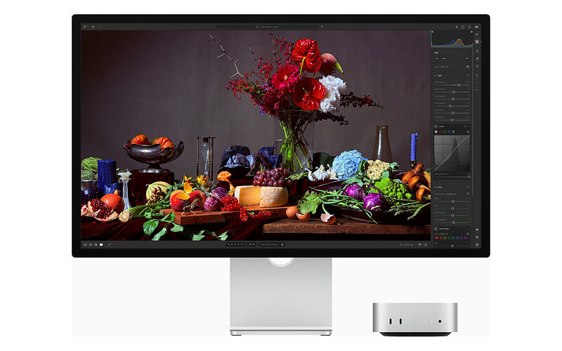

### BenQ

**[PD2730S](https://www.benq.com/en-us/monitor/creative-pro/pd2730s.html)** — nejrozumnější non-Apple volba a favorit většiny recenzí. **Nano Matte** povrch (TÜV certifikace reflection-free), 98 % DCI-P3, ΔE ≤ 2, DisplayHDR 400, 60 Hz. Thunderbolt 4 upstream i downstream s **90 W** PD a daisy-chain na dva 5K panely, k tomu HDMI 2.1, DP 1.4, 3× USB-A a KVM přepínač pro Mac i PC. [Heureka](https://monitory.heureka.cz/benq-pd2730s/) · [česká recenze na PCTuning](https://pctuning.cz/article/recenze-monitoru-benq-pd2730s-5k-rozliseni-i-presne-barvy)

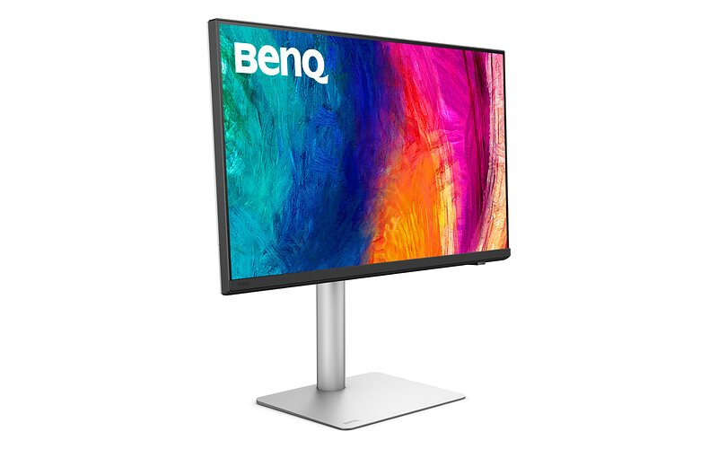

**[MA270S](https://www.benq.eu/cs-cz/monitor/home/ma270s.html)** — postavený přímo pro Mac: **Nano Gloss** povrch (lesklý jako Studio Display, ale s potlačenými odlesky), 450 nitů, 99 % P3, **70 Hz**. Thunderbolt 4 s **96 W** + samostatný USB-C s 35 W, 2× HDMI 2.1, Smart KVM pro macOS, ICCsync pro synchronizaci barevných profilů a nabíjení i při vypnutém monitoru. [Heureka](https://monitory.heureka.cz/benq-ma270s_2/)

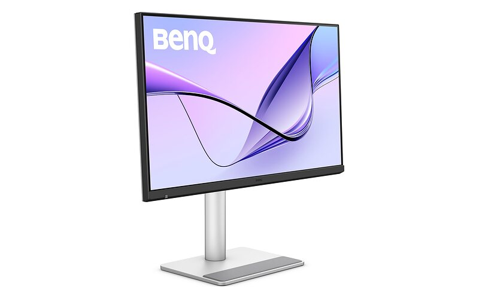

### Philips

**[27E3U7903](https://www.philips.co.uk/c-p/27E3U7903_00/brilliance-5k-monitor)** — na papíře nejlepší poměr cena/výkon v této skupině: **DisplayHDR 600** s lokálním stmíváním, 500 nitů SDR / 600 nitů HDR, 99 % DCI-P3 **a** 99,5 % Adobe RGB, kontrast 2 000:1, **70 Hz**. Thunderbolt 4 jako vstup i výstup (daisy-chain), 5MP webkamera s AI a Calman Ready pro automatickou kalibraci. Antireflexní přední sklo, tedy ne úplně lesklý povrch.

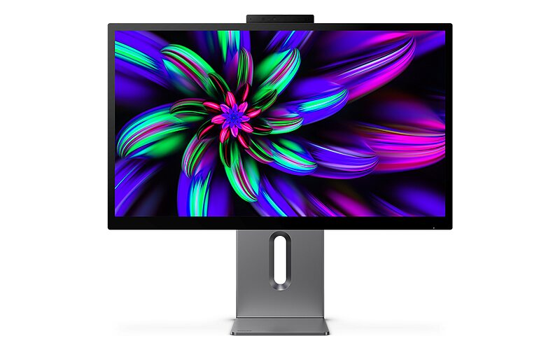

### ViewSonic

**[VP2788-5K](https://www.viewsonic.com/colorpro/products/VP2788-5K)** — ColorPro řada s tovární kalibrací a Pantone validací, 500 nitů, 99 % DCI-P3, kontrast 2 000:1, VESA HDR400, 10bit (8bit + FRC), 60 Hz. Dva Thunderbolt 4 (upstream **100 W**, downstream 15 W) s daisy-chain na dva 5K, HDMI 2.1, DP 1.4. Povrch antireflexní s tvrdým 3H coatingem. [Alza](https://www.alza.cz/27-viewsonic-vp2788-5k-d13089235.htm) · [Heureka](https://monitory.heureka.cz/viewsonic-vp2788-5k/)

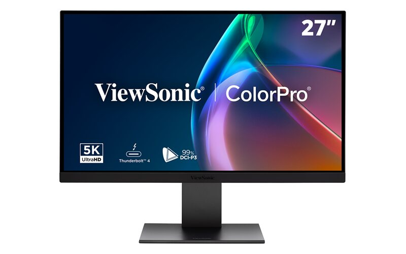

### Asus

**[ProArt Display 5K PA27JCV](https://www.asus.com/displays-desktops/monitors/proart/proart-display-5k-pa27jcv/)** — cenové dno pro 218 PPI. 400 nitů (500 v HDR), 99 % DCI-P3, 95 % Adobe RGB, ΔE < 2, 60 Hz s Adaptive-Sync, AGLR antireflexní povrch. Hlavní ústupek: **jen USB-C s DP Alt Mode (96 W), žádný Thunderbolt**, takže bez daisy-chain. K tomu DP 1.4, HDMI 2.1 a USB hub. [Alza](https://www.alza.cz/27-asus-proart-display-5k-pa27jcv-d12963821.htm)

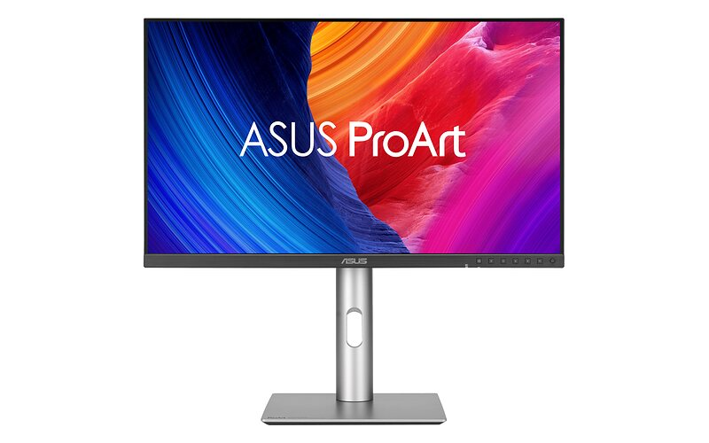

**[ROG Strix 5K XG27JCG](https://rog.asus.com/monitors/27-to-31-5-inches/rog-strix-5k-xg27jcg/)** — specialita: 5K při **180 Hz** (dual-mode přepne na 1440p/330 Hz), 0,3 ms GTG, ELMB 2. Pro práci je ale slabší — 350 nitů SDR, kontrast jen 1 000:1 a 97 % P3. Dává smysl jen když na stejném stole potřebujete Retina text i herní frekvenci.

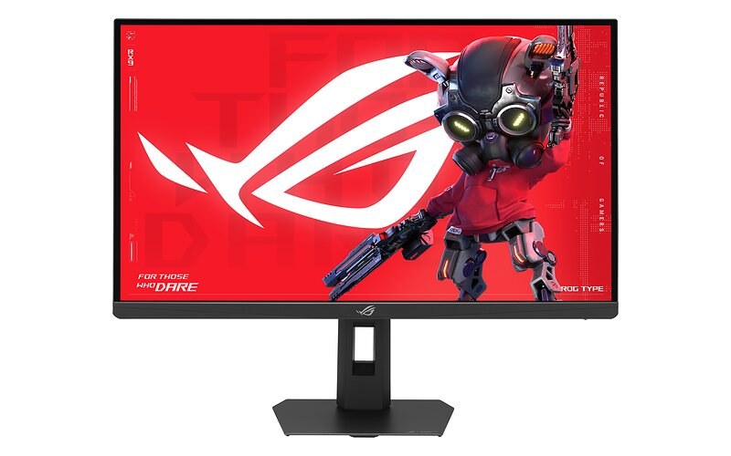

### Samsung

**[ViewFinity S8 S80HF](https://www.samsung.com/uk/monitors/high-resolution/viewfinity-s8-s80hf-27-inch-5k-usb-c-easy-connection-ls27h804efaxxu/)** — nejlevnější cesta k 5K, ale **pokrývá jen 99 % sRGB, nikoli P3**. Pro barevnou práci na Macu (který pracuje v Display P3) je to zásadní omezení. 350 nitů, kontrast 1 000:1, 60 Hz, USB-C s **90 W**, HDMI 2.1, DP 1.4, Ethernet a KVM. Brát jen jako kancelářský panel.

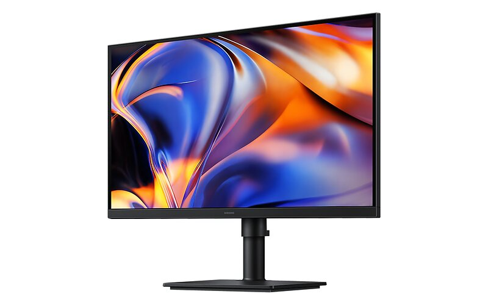

## 32" 6K (218–224 PPI)

| Model | Panel / povrch | Jas | Kontrast | Gamut | Cena |
|-------|----------------|-----|----------|-------|------|
| LG UltraFine 32U990A | Nano IPS Black | 450 nits, DisplayHDR 600 | 2 000:1 | 98 % DCI-P3, 99,5 % Adobe RGB | ~48&nbsp;590&nbsp;Kč |
| Asus ProArt PA32QCV | IPS / AGLR antireflexní | 400 nits (600 HDR) | 1 500:1 (max 3 000:1) | 98 % DCI-P3, 100 % sRGB | ~35&nbsp;750&nbsp;Kč |

### LG

**[UltraFine 32U990A](https://www.lg.com/cz/monitory/ultrafine-uhd-4k-monitory/32u990a-s/)** — 6144 × 3456 na 31,5", tedy nejvyšší hustota v přehledu (**224 PPI**), a první 6K monitor s **Thunderbolt 5**. Nano IPS Black posouvá kontrast na 2 000:1, DisplayHDR 600, 99,5 % Adobe RGB, hardwarová kalibrace, Studio Mode presety pro Mac. Kromě TB5 (**96 W** PD) je tu **DisplayPort 2.1** a HDMI 2.1. 60 Hz. [Alza](https://www.alza.cz/32-lg-ultrafine-32u990a-s-d13232274.htm) · [Heureka](https://monitory.heureka.cz/lg-ultrafine-32u990a-s/)

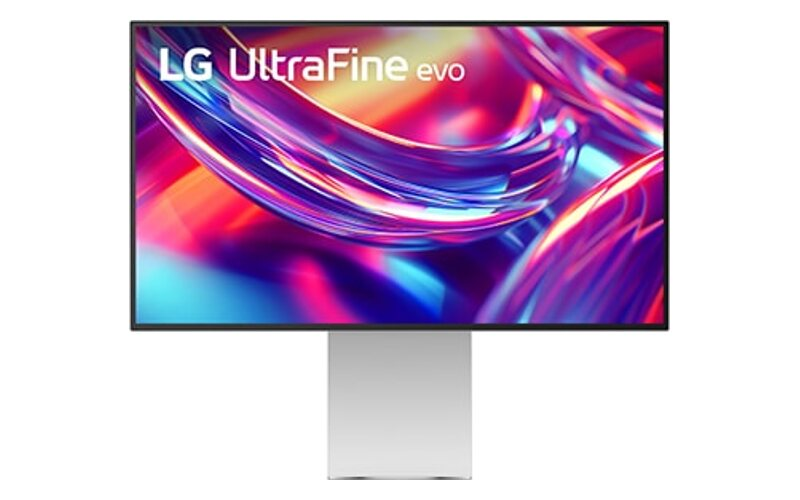

### Asus

**[ProArt Display 6K PA32QCV](https://www.asus.com/displays-desktops/monitors/proart/proart-display-6k-pa32qcv/)** — 6016 × 3384 na 31,5" (218 PPI) za zhruba tři čtvrtiny ceny LG. 400 nitů typicky / 600 v HDR, DisplayHDR 600, 98 % DCI-P3, Calman certifikace, 60 Hz s Adaptive-Sync (48–60 Hz). Dva **Thunderbolt 4** s daisy-chain a **96 W** PD, DP 1.4 DSC, HDMI 2.1, USB hub. Antireflexní AGLR povrch. Nejlepší poměr cena/plocha/ostrost v celém přehledu. [Alza](https://www.alza.cz/31-5-asus-proart-display-6k-pa32qcv-d13245352.htm)

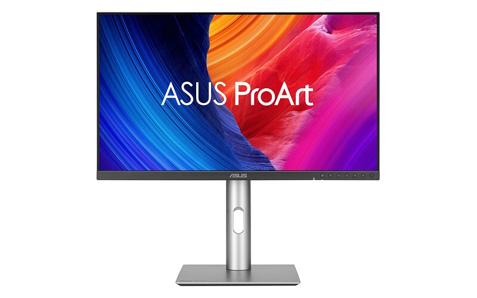

## 4K výjimky

Pod 218 PPI má smysl jít jen tehdy, když panel nabízí něco, co 5K/6K IPS neumí — OLED kontrast, vysokou frekvenci nebo poměr stran 3:2. Text bude na Macu vždy měkčí.

| Model | Panel | Velikost / rozlišení | PPI | Hz | Cena |
|-------|-------|----------------------|-----|-----|------|
| Samsung Smart Monitor M9 (M90SF) | QD-OLED | 31,5" / 3840 × 2160 | 140 | 165 | — |
| Asus ProArt PA279CDV | QD-OLED | 26,5" / 3840 × 2160 | 166 | 120 | — |
| BenQ RD280UG | Nano Matte IPS | 28,2" / 3840 × 2560 (3:2) | 164 | 120 | — |
| Asus ProArt PA27DCE-K | OLED | 26,9" / 3840 × 2160 | 164 | 60 | od ~60&nbsp;336&nbsp;Kč |

**[Samsung Smart Monitor M9 (M90SF)](https://www.samsung.com/cz/monitors/smart/smart-monitor-m9-32-inch-smart-tv-apps-4k-oled-ls32fm900suxdu/)** — 4K QD-OLED se 165 Hz a 0,03 ms, DisplayHDR True Black 400, HDR10+, matný antireflexní povrch. Zabudovaný Tizen se streamovacími aplikacemi, 4K kamera, Wi-Fi. USB-C s **65 W** PD, 2× HDMI 2.1, DP 1.4, USB-A. Nejlepší volba, když má jeden panel sloužit jako monitor i televize. [Alza](https://www.alza.cz/32-samsung-smart-m9-m90sf-d13091269.htm)

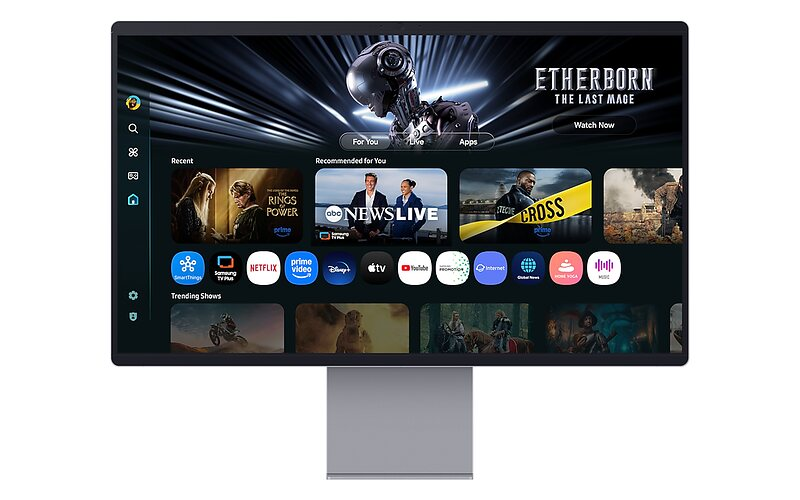

**[ProArt Display OLED PA279CDV](https://www.asus.com/displays-desktops/monitors/proart/proart-display-oled-pa279cdv/)** — 26,5" QD-OLED, kontrast **1 500 000:1**, 99 % DCI-P3, 1 000 nitů peak HDR (250 nitů typicky), 120 Hz s Adaptive-Sync, 0,1 ms. USB-C **96 W**, 2× DP 1.4, HDMI 2.1, KVM. Tříletá záruka **včetně vypálení panelu**.

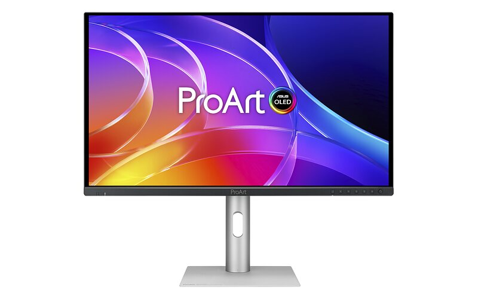

**[RD280UG](https://www.benq.com/en-us/monitor/programming/rd280ug.html)** — 28,2" v poměru **3:2** (3840 × 2560), tedy výrazně víc vertikálního místa na kód než 16:9. Nano Matte povrch, kontrast 2 000:1, 120 Hz, MoonHalo podsvícení, USB-C **90 W** s daisy-chain přes MST, Smart KVM a sada TÜV certifikací pro oči.

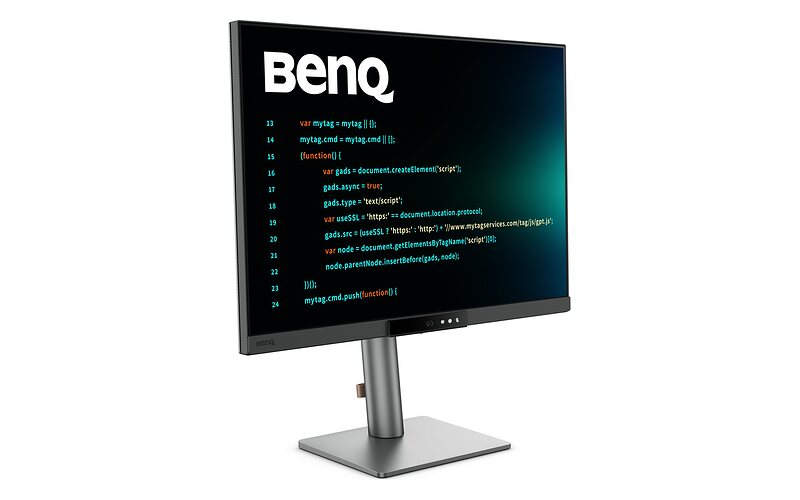

**[ProArt Display OLED PA27DCE-K](https://www.asus.com/cz/displays-desktops/monitors/proart/proart-display-oled-pa27dce-k/)** — referenční OLED: **ΔE < 1**, 99 % DCI-P3, 99 % Adobe RGB, 90 % Rec.2020, kontrast 1 000 000:1, hardwarová kalibrace. Jen 200 nitů typicky (350 peak) a 60 Hz. Cena postupně klesla z původních ~90 000 Kč, pořád ale dává smysl jen pro barevný grading. [Mironet](https://www.mironet.cz/27-asus-proart-pa27dcek-cerna-led-3840-x-2160-oled-169-01-ms-1m1-200-cdm2-hdmidpusbc+dp649910/) · [Heureka](https://monitory.heureka.cz/asus-pa27dce/)

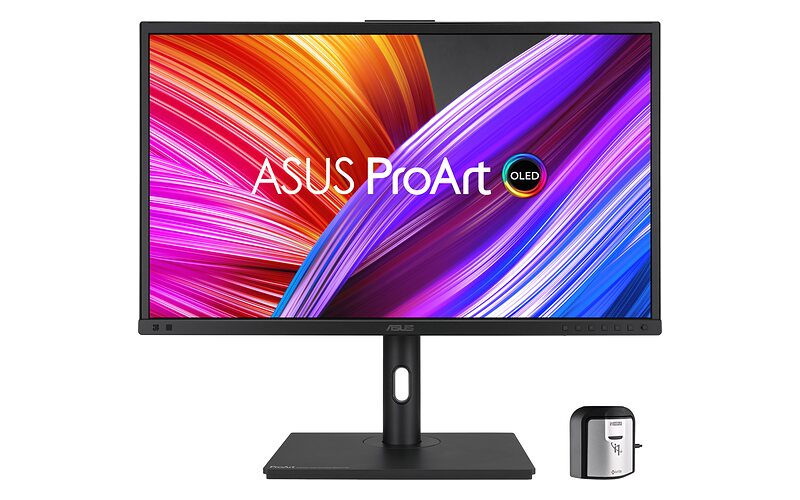

## Na co si dát pozor

:::caution
**Thunderbolt vs. USB-C.** Panely s pouhým USB-C DP Alt Mode (např. Asus PA27JCV) neumí daisy-chain a nemají plnou 40 Gb/s propustnost pro připojený hub. Pro MacBook s jedním kabelem na stole je Thunderbolt 4/5 podstatný rozdíl.
:::

- **Power Delivery** — 96 W stačí na MacBook Pro 14", 16" model při zátěži potřebuje víc a bude se dobíjet pomaleji. 140 W nabízí zatím jen Studio Display XDR.
- **Povrch** — lesklý (Nano Gloss, Apple sklo) dává sytější barvy a hlubší černou, matný lépe zvládá okna za zády. Nano-texture a Nano Matte jsou kompromisem s mírnou ztrátou kontrastu.
- **Obnovovací frekvence** — většina 5K/6K panelů je 60 Hz. Nad to jdou jen Studio Display XDR (120 Hz), Asus XG27JCG (180 Hz) a 70Hz panely BenQ MA270S a Philips 27E3U7903.
- **Barevný prostor** — macOS pracuje v Display P3. Panel s pokrytím pouze sRGB (Samsung S80HF) bude zobrazovat P3 obsah nepřesně.

## Sources

- [Best new Mac displays](https://9to5mac.com/2026/08/26/best-new-mac-displays/) — 9to5Mac, výchozí výběr modelů a jejich hodnocení
- [TFTCentral](https://tftcentral.co.uk/) — nezávislé specifikace panelů (Philips 27E3U7903, LG 32U990A, Samsung S80HF, Asus XG27JCG)
- Technické specifikace výrobců Apple, Asus, BenQ, LG, Philips, Samsung a ViewSonic — odkazy u jednotlivých modelů
- Produktové fotografie pocházejí z tiskových a produktových materiálů příslušných výrobců
