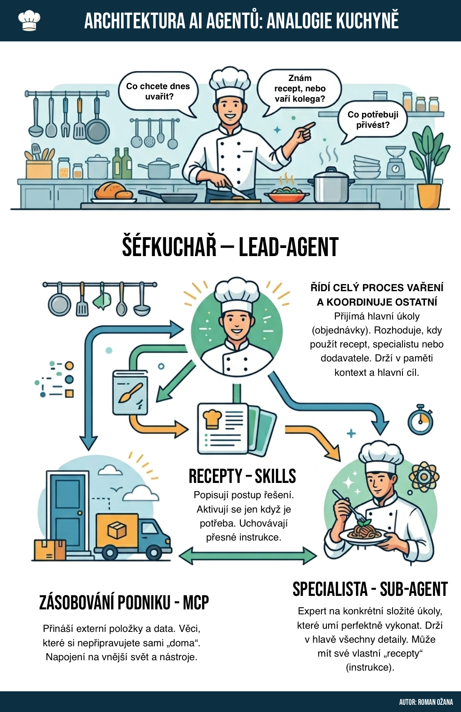

Moderní AI systémy se čím dál tím více skládají z více spolupracujících agentů. Jak celou tuto architekturu pochopit? Nejlépe pomocí analogie **restaurační kuchyně**.

## Šéfkuchař – Lead Agent

**Řídí celý proces a koordinuje ostatní.** Přijímá hlavní úkoly (objednávky od hostů), rozhoduje, kdy použít recept, kdy zavolat specialistu a kdy objednat zboží od dodavatele. Drží v paměti kontext a hlavní cíl celého procesu.

## Recepty – Skills

**Popisují postup řešení konkrétních úkolů.** Aktivují se jen tehdy, kdy jsou potřeba. Uchovávají přesné instrukce – jak něco uvařit krok za krokem. Nejsou to samostatné osoby, ale znalosti uložené v systému.

## Specialista – Sub-Agent

**Expert na konkrétní složité úkoly**, které umí perfektně vykonat. Drží v hlavě všechny detaily své specializace. Může mít své vlastní „recepty" (instrukce) a pracuje relativně samostatně na dílčím úkolu, který mu šéfkuchař zadá.

## Zásobování podniku – MCP

**Model Context Protocol (MCP)** je zásobovací systém kuchyně. Přináší externí položky a data – věci, které si nepřipravujete sami „doma". Zajišťuje napojení na vnější svět: databáze, API, soubory, nástroje a další zdroje, které agenti potřebují ke své práci.

---

Celá tato architektura umožňuje stavět AI systémy, které jsou **modulární, škálovatelné a specializované** – stejně jako dobrá kuchyně, kde každý ví, co má dělat.
