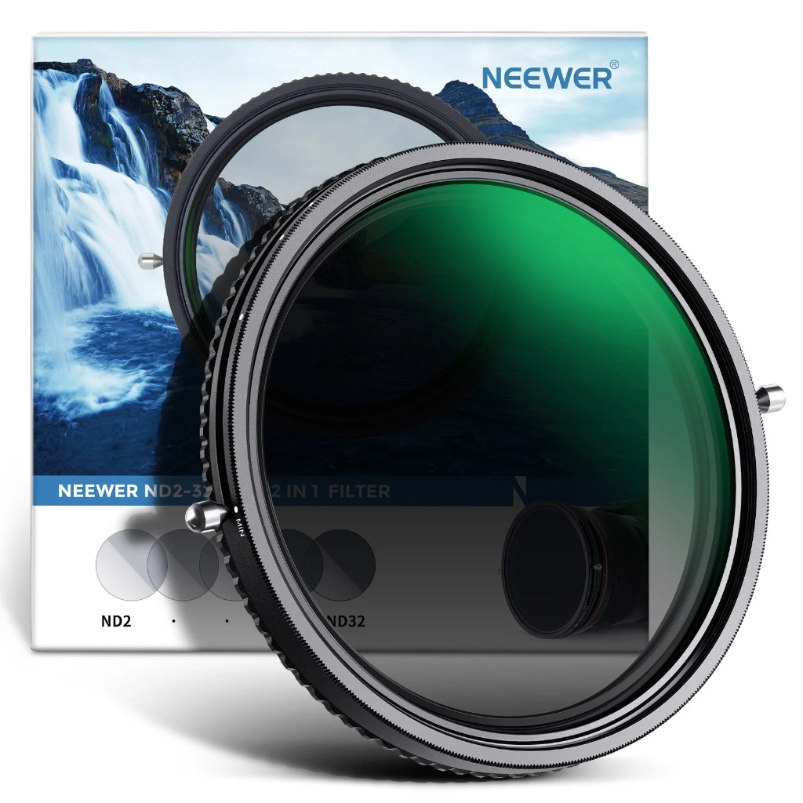
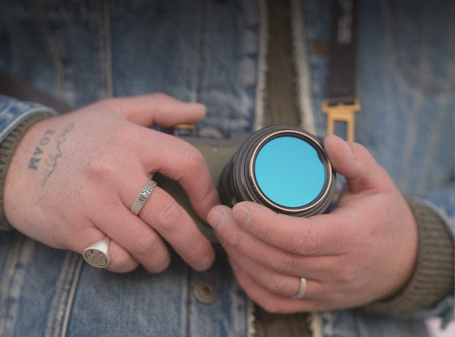

This page covers **screw-in** filters for stills and video: neutral density (**ND**), circular polarisers (**CPL**), combined designs, and a few **creative / look** filters. Use it for buying checks and short product notes.

## Choosing screw-in filters

| Topic | What to check |
|--------|----------------|
| **Thread size** | Match the lens **Φ** marking (e.g. 67 mm, 77 mm). Wrong size needs step rings or the wrong filter. |
| **Stack height** | Thick rings or stacking filters can **vignette** on wide angles. Thin profiles help. |
| **Variable ND** | On wide lenses, “X-pattern” uneven darkening can appear at strong ND settings; many filters **limit the rotation range** to avoid it. |
| **CPL + ND combo** | A 2-in-1 saves one stack position; you still rotate one ring for polarisation after setting density. |

:::tip
If the filter’s front diameter is larger than the lens barrel, your **original lens cap** may not fit — plan for a **cap that fits the filter** or a pouch.
:::

## Neewer 2-in-1: variable ND + CPL

### Overview

**[NEEWER 2 in 1 Variable ND Filter ND2–ND32 & CPL Filter](https://eu.neewer.com/products/neewer-2-in-1-variable-nd-filter-nd2-nd32-cpl-filter-66601418)** — one ring that combines **variable ND** roughly **ND2–ND32** (about **1–5 stops**) with a **circular polariser**. After setting the ND, rotate to dial in polarisation (water and glass reflections, sky saturation).

### Specifications

| | |
|--|--|
| Type | Variable ND + CPL |
| Density range | ND2–ND32 (~1–5 stops) |
| Threads | 37, 43, 46, 49, 52, 55, 67, 72, 77 mm |
| Glass | HD optical glass; nano coatings (water/oil/dust resistance, lower reflectance) |
| Frame | CNC aluminium; slim profile (~**7.6 mm** frame depth excluding thread height) |

### Field notes

Neewer documents a **limited rotation range** on variable NDs to reduce **cross-pattern** artefacts and heavy vignetting on wide glass — still test on your widest lens. Confirm thread size from the lens **Φ** stamp before ordering.

### In the box

Filter, pouch, cleaning cloth.

## PolarPro Portra Filter

**[PolarPro Portra Filter](https://www.polarpro.com/products/portra-filter)** — **creative** screw-in (and **Helix** system) filter that targets a **Portra 400–inspired** colour response **in camera**, not in post. Optically it mixes **warm/natural tone**, **subtle white mist diffusion** (PolarPro describes it as **1/4** strength), and a **rotating chroma polariser** for glare control and richer separation.

| | |
|--|--|
| *Intent* | Film-inspired warmth, creamy skin, softer highlight roll-off |
| *Polarisation* | **Adjustable** “chroma” polariser (rotate for reflections) |
| *Threads (screw-in)* | **49, 67, 77, 82, 86 (c), 95 (c)** mm — confirm **Φ** on each lens |
| *Also* | **Helix** drop-in variant for quick swaps in the field |

:::note
PolarPro states the filter is **inspired by** Portra 400, not a lab-accurate emulation — expect a **repeatable look at capture**, then normal grading on top. **Stock and ship dates** on PolarPro’s store change with product waves; check the live page before ordering.
:::

## Related

- [Camera gear](../camera-gear)
- [Straps](../straps)
- [Tripods](../tripods)
- [Flash](../flash)

## Sources

- [PolarPro — Portra Filter](https://www.polarpro.com/products/portra-filter) — features, FAQ, thread sizes (access **2026-04-06**)
- Product image: [PolarPro Shopify CDN — portra-filter-collage-1.jpg](https://cdn.shopify.com/s/files/1/1050/9944/files/portra-filter-collage-1.jpg)
