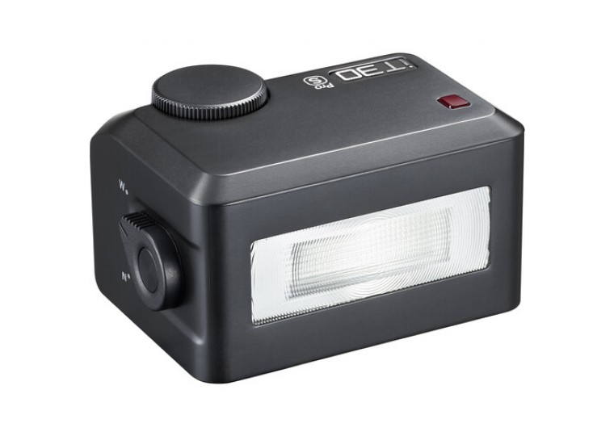
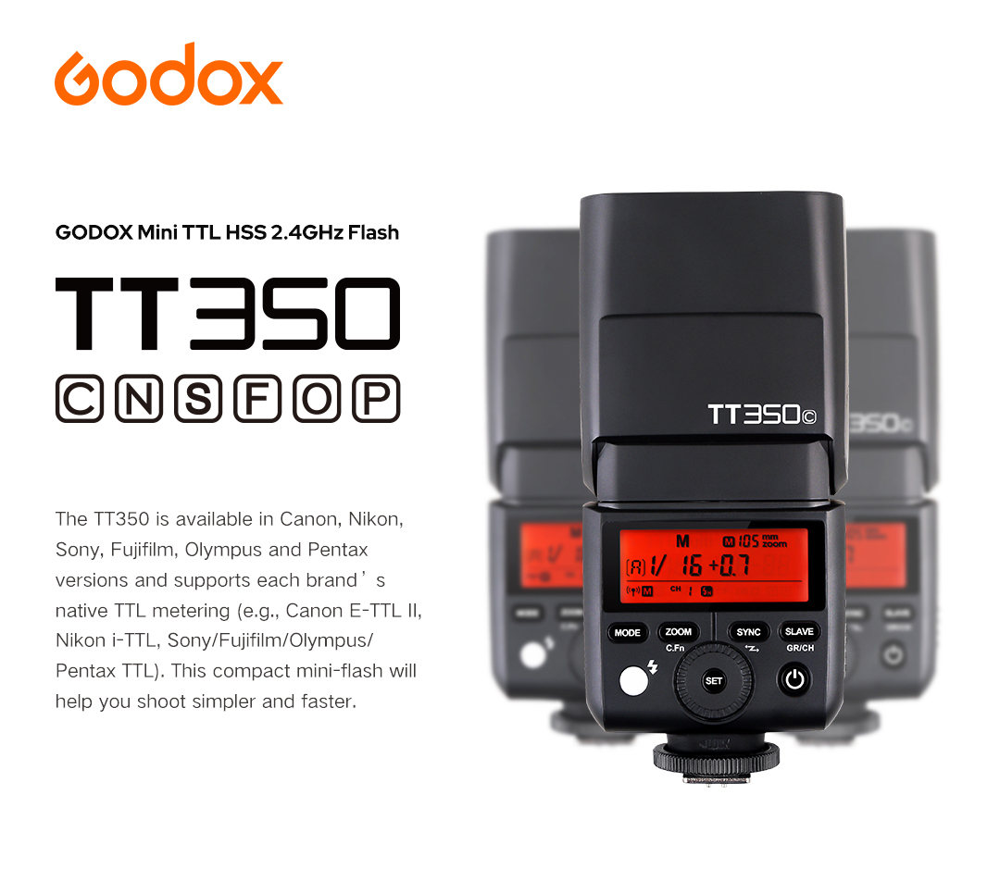
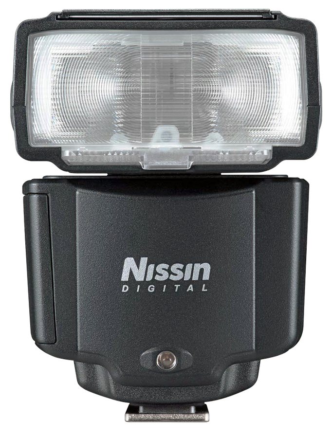

Compact **TTL** and **manual** shoe flashes for **Fujifilm**, **Sony**, **Canon**, and other mirrorless systems: **size**, **guide number**, **radio** (especially **Godox X**), and **HSS** when you want a pocketable fill light instead of a full-size speedlight.

## Market snapshot (2025–2026)

Ultra-compact flashes shrank again: **Godox** covers **iT** (tiny TTL cubes through **iT30 Pro** and modular **iT32** + **X5**), **iM** (manual minis), and classic **TT350** / **V350**. **Viltrox** competes hard on **price** (**Vintage Z2**, **Spark Z3**). The former benchmark **Nissin i400** is effectively **gone** with **no successor**; **Metz** flash production ended after **Mecatech** insolvency — used **Metz** means **no** firmware support and **uncertain** new-body compatibility. For **small + TTL + Godox X**, **Godox** still leads; **Canon** / **Sony** OEM units integrate best but cost more or occupy more bag space.

Approximate **CZK** in the table below matches the **2025–2026** shopping survey this page is based on (~**23 CZK** ≈ **1 USD** in that survey); confirm current listings before you buy.

## Comparison table (compact class)

Systems: **C** Canon, **N** Nikon, **S** Sony, **F** Fujifilm, **O** OM System. **GN** = guide number (**m**, **ISO 100**) from manufacturer / survey figures.

| Model | GN | Weight | TTL | Radio / slave | Tilt | Power | ~CZK |
|-------|---:|-------:|:---:|:--------------|:----:|:------|-----:|
| [Godox iT20 / iT22](https://www.godox.com/product-e/iT20-iT22.html) | ~10 | 45–52 g | Y C/N/S/F/O | — | —* | Li-ion USB-C | ~1 150 |
| [Viltrox Vintage Z2](https://viltrox.com/products/vintage-z2-camera-flash) | ~6 | 52 g | Y C/N/S/F | — | — | Li-ion USB-C | ~850 |
| Godox [iM20 / iM22](https://www.godox.com/product-a/iM20-iM22.html) / [iM30](https://www.godox.com/product-a/iM30.html) | ~10–15 | 31–78 g | Manual | — / S1S2† | — | Li-ion / 2×AAA | ~690–780 |
| [Godox Lux Elf](https://www.godox.com/product-a/Flash/LUX-ELF.html) | ~6 | 96 g | Manual | S1/S2 | — | Li-ion USB-C | ~1 130 |
| **[Godox iT30 Pro](https://www.godox.com/product-e/iT30Pro.html)** | **15** | **120 g** | **Y** | **Godox X** | —* | Li-ion USB-C | **~2 290** |
| [Viltrox Z1 / Z1+](https://viltrox.com/collections/camera-flash) | ~12 | 116–132 g | Manual | S1/S2 | — | Li-ion USB-C | ~1 150 |
| [LightPix FlashQ X20](https://www.lightpixlabs.com/pages/x20) ‡ | 20 | ~115 g | Y **S/F** | FlashQ 2.4 GHz | 90° | 2× AA | ~3 000 |
| [SmallRig RS20](https://www.smallrig.com/RS20-mini-Speedlite-Flash-5374.html) | ~12 ‡‡ | 128 g | Manual | — | — | Li-ion USB-C | TBD |
| [Viltrox Spark Z3](https://viltrox.com/products/z3-camera-flash) | ~16 | 144 g | Y C/N/S/F | S1/S2 | — | Li-ion USB-C | ~1 265 |
| [Meike MK-320](https://meikeglobal.com/products/mk320s-ttl-speedlite-flash-photographer-exposure) | 32 | 150 g | Y | S1/S2 | 90° | 2× AA | ~2 190 |
| **[Godox iT32 + X5](https://www.godox.com/product-e/iT32-X5.html)** | **18** | **169 g** | **Y** | **Godox X** | **90°/270°** | Li-ion USB-C | **~2 300** |
| [Godox Lux Junior](https://www.godox.com/product-a/Lux-Junior.html) | 12 | 130 g | Manual | S1/S2 | — | 2× AAA | ~1 370 |
| [Godox Lux Cadet](https://www.godox.com/product-a/Lux-Cadet.html) | 10 | 171 g | Manual | S1/S2 | — | Li-ion USB-C | ~2 070 |
| [Canon Speedlite EL-100](https://www.canon.co.uk/cameras/speedlite-flash-el-100/) | 26 | 190 g | Canon | Optical | 90°/330° | 2× AA | ~4 000 |
| [Nissin i400](https://www.nissindigital.com/i400) | 40 | 203 g | Y | — | 90°/360° | 4× AA | **EOL** |
| [Nissin i40](https://www.nissindigital.com/i40) | 40 | 203 g | Y | Optical | 90°/360° | 4× AA | **EOL** |
| **[Godox TT350](https://www.godox.com/product-d/TT350.html)** | **36** | **210 g** | **Y** | **Godox X** | **90°/270°** | 2× AA | **~2 400** |
| [Sony HVL-F28RM](https://www.sony.com/electronics/interchangeable-lens-cameras-flashes-lights/hvl-f28rm) | 28 | 219 g | Sony | **Sony 2.4 GHz** | 120° | 2× AA | ~5 700 |
| Metz M400 | 40 | 220 g | Y | Optical | 90°/360° | 4× AA | **Defunct** |
| [Yongnuo YN320EX](https://yongnuo.eu/flashes/ttl-flash-aa-battery/yn320ex-gn31-ttl/) | 31 | 225 g | Sony | YN 2.4 GHz | 90°/270° | 2× AA | ~1 500 |
| [Godox V350](https://www.godox.com/product-d/V350.html) | 36 | 290 g | Y | **Godox X** | 90°/270° | Li-ion | ~4 000 |
| [Canon Speedlite EL-10](https://www.canon.co.uk/cameras/speedlite-flash-el-10/) | 40 | 287 g | Canon (MFS) | Radio | 90°/330° | 4× AA | ~5 500 |
| [Nissin i60A](https://www.nissindigital.com/i60a) | 60 | 300 g | Y | NAS 2.4 GHz | 90°/360° | 4× AA | ~5 500 |

\* **Godox** documents **HSS** and **tilt** for **iT20** / **iT22** together with the optional **TR TTL Hot Shoe Riser** — see the [iT20 / iT22](https://www.godox.com/product-e/iT20-iT22.html) page. **iT30 Pro** needs a riser or modifier strategy for ceiling bounce (no built-in tilt).  
† **iM30**: optical slave **S1/S2**; **iM20**/**iM22**: typically no slave in the same way — check SKU.  
‡ **X20**: **TTL** only with bundled **Fujifilm** or **Sony** transmitter; slow full-power recycle (**~5–6 s**), **2× AA**.  
‡‡ **RS20**: check **SmallRig** sheet for exact **GN** / sync limits (survey: “**12**” class).

## Under ~100 g: built-in-flash replacement

**[Godox iT20 / iT22](https://www.godox.com/product-e/iT20-iT22.html)** — Smallest **TTL** units in the survey (**~45 g** / **~52 g**); **USB-C** Li-ion; **no** built-in **Godox X** radio; straight-ahead aim unless you add **Godox**’s **TR** riser / bounce workflow. **GN ~10** class; fine for **2–3 m** social distances if you lift **ISO** as needed. Survey note: no **radio**, and **HSS** / **tilt** are tied to **TR** in Godox’s own materials — verify your body.

**[Viltrox Vintage Z2](https://viltrox.com/products/vintage-z2-camera-flash)** — Very low street price; **fold-flat** body; **TTL** for **C/N/S/F**; **GN ~6** is extremely weak (**~1.5–2 m** at **ISO 100** without **ISO** lift). No **HSS**, no **radio**, no tilt — emergency close-fill only.

**[Godox iM20](https://www.godox.com/product-a/iM20-iM22.html) / [iM22](https://www.godox.com/product-a/iM20-iM22.html) / [iM30](https://www.godox.com/product-a/iM30.html)** — **Manual** line; **iM20**/**iM22** down to **~31–34 g**; **iM30** trades size for **GN ~15** and **S1/S2** slave. No **TTL**.

**[Godox Lux Elf](https://www.godox.com/product-a/Flash/LUX-ELF.html)** — Retro **manual** micro flash (**GN ~6**); style over duty for serious **TTL** work.

## ~100–170 g: pocket TTL with real features

**[Godox iT30 Pro](https://www.godox.com/product-e/iT30Pro.html)** — Survey **default pick** for most users: **~120 g**, **2.8″ touchscreen**, **Godox X** master/slave, **HSS**, **TTL**, **multi**, **USB-C** Li-ion (**~560** full-power pops claimed). **GN 15** is the limiter — think **built-in-flash** class power, not big-room bounce without **ISO**. Can **command** larger **Godox** units (**AD200**, **V1**, …) from the shoe. CZ example retailer: **[Megapixel.cz](https://www.megapixel.cz/)** — search **Godox iT30 Pro**.

**[Godox iT32 + X5](https://www.godox.com/product-e/iT32-X5.html)** — Modular head (**~169 g**, **GN ~18**) on mount-specific **X5** shoe; **90° / 270°** tilt/swivel for **bounce**, **modelling LED**, magnetic modifiers. **X5** modules are bought **per system** (survey: **~460–780 CZK** for the trigger slice depending on mount). Same shop class: **[Megapixel.cz](https://www.megapixel.cz/)** — search **Godox iT32**.

**[Viltrox Spark Z3](https://viltrox.com/products/z3-camera-flash)** — **Cyber** styling, **~26 Ws** marketing, fast recycle in reviews; survey warns **no** **HSS**, **no** tilt, **no** **Godox**-style radio, and weak or missing **TTL FEC** depending on firmware — confirm before import.

**[LightPix FlashQ X20](https://www.lightpixlabs.com/pages/x20)** — Detachable **2.4 GHz** transmitter; **GN 20**, **90°** tilt, bi-colour LED; **TTL** only for **[Fujifilm](https://www.lightpixlabs.com/products/flashq-x20-for-fujifilm)** / **[Sony](https://www.lightpixlabs.com/products/flashq-x20)** bundles. Trade-off: **slow** full-power recycle (**~5–6 s**), **2× AA**.

**[Meike MK-320](https://meikeglobal.com/products/mk320s-ttl-speedlite-flash-photographer-exposure)** — **GN 32** in a slim **~110 × 65 × 36 mm** body, tilting head, **TTL**, **S1/S2**; survey: **no** built-in radio **HSS**, **~5 s** full recycle, patchy regional availability.

## ~200–300 g: more power, bigger pouch

**[Godox TT350](https://www.godox.com/product-d/TT350.html)** — Survey “**best GN/size trade-off**” in **AA** class: **GN 36** (**105 mm** zoom story), **24–105 mm** motor zoom, full tilt/swivel, **Godox X**, **HSS**. Slower full-power recycle (**~2.2 s**) and heavier **ready** weight than **Li-ion** **V350**. Common Adorama house label: **Flashpoint Zoom-Mini TTL R2** (same class — verify exact SKU).

**[Godox V350](https://www.godox.com/product-d/V350.html)** — **TT350**-class output with **VB20** **Li-ion** pack: faster recycle (**~1.7 s** class), **~290 g** with battery.

**[Sony HVL-F28RM](https://www.sony.com/electronics/interchangeable-lens-cameras-flashes-lights/hvl-f28rm)** — Best **Sony-only** integration: **[specs](https://www.sony.com/electronics/support/camera-camcorder-accessories-flashes-and-lights/hvl-f28rm/specifications)**, **2.4 GHz**, sealing, **face-detection flash** on supported bodies; **GN 28**, bounce **120°** without rotation; priced above **Godox**.

**[Canon Speedlite EL-100](https://www.canon-europe.com/for_home/speedlite-flash-el-100)** — Compact **Canon** **TTL**, optical wireless, tilting head; survey flags **slow** full-power recycle and value vs **TT350** — check current **Canon** specs for **HSS** on your body.

**[Canon Speedlite EL-10](https://www.canon-europe.com/for_home/speedlite-flash-el-10/)** — **Multi-Function Shoe** only; **radio**, **GN 40**, heavier than “pocket mini”.

**[Yongnuo YN320EX](https://yongnuo.eu/flashes/ttl-flash-aa-battery/yn320ex-gn31-ttl/)** — Budget **Sony** **TTL** with **YN** radio; survey: fragile foot reports and **TTL** quirks.

## Discontinued or legacy (still listed for reference)

**Nissin [i400](https://www.nissindigital.com/i400)** — Strong **GN** and ergonomics for size; **no** radio; **discontinued**, **no** direct replacement. **[i40](https://www.nissindigital.com/i40)** similarly dead; **[i60A](https://www.nissindigital.com/i60a)** lingers with **NAS** radio but the line is stagnant.

**Metz** — Insolvency **2020–2021**; **M400** / compact **26 AF-2** are legacy — **avoid** for new bodies unless you accept risk.

## Godox Lux (retro, style-first)

**[Lux Junior](https://www.godox.com/product-a/Lux-Junior.html)** (~**GN 12**), **[Lux Cadet](https://www.godox.com/product-a/Lux-Cadet.html)** (**~GN 10**, USB-C Li-ion), **[Lux Senior](https://www.godox.com/product-a/Lux-Senior.html)** (**~GN 14**): **manual / auto** styling flashes, **S1/S2** on many SKUs, **no** **Godox X** on the classic bodies. **Lux Master** adds **Godox X** / **TTL** via external control but leaves the “pocket” bracket — see the **[Lux series hub](https://www.godox.com/Retro-Camera-Flashes/)** on Godox.

## Not in the compact class (survey exclusion)

**[Profoto](https://profoto.com/) A1X/A10** — Round-head quality but **~4×** the bulk of **iT30 Pro**; luxury tier. **A2** is a **100 Ws** off-camera monolight style unit, not a shoe-speedlight workflow.

**Neewer** — **Z1** / **NW420** are full-size speedlight clones; **Neewer Q** radio ≠ **Godox X**.

**Westcott FJ80 II** — Competent **FJ**-radio speedlight, too heavy for this page’s compact brief.

## Picks by use case

| Goal | Pick |
|------|------|
| Best pocket all-rounder (**TTL + HSS + Godox X**) | **[Godox iT30 Pro](https://www.godox.com/product-e/iT30Pro.html)** |
| Pocket + **ceiling bounce** + **Godox X** | **[Godox iT32 + X5](https://www.godox.com/product-e/iT32-X5.html)** |
| Best **GN** in a still-small **AA** light | **[Godox TT350](https://www.godox.com/product-d/TT350.html)** |
| Cheapest **TTL** (weak **GN**) | **[Viltrox Vintage Z2](https://viltrox.com/products/vintage-z2-camera-flash)** |
| **Sony** ecosystem, money less important | **[Sony HVL-F28RM](https://www.sony.com/electronics/interchangeable-lens-cameras-flashes-lights/hvl-f28rm)** |
| Cheap **manual** mini with slave | **[Godox iM30](https://www.godox.com/product-a/iM30.html)** |
| Off-camera “big small” (**100 Ws** pack, not shoe bounce) | **[Godox AD100 Pro II](https://www.godox.com/product-e/AD100ProII.html)** |

## Where the market is heading

Miniaturisation is bumping physics (**iT20** **45 g**, **Vintage Z2** **52 g**) at **GN 6–10**. **Modular** **iT32** + **X5** hints at **cross-system** shoe brains on one flash body. **Godox X** still has the broadest **compact** stack; **Viltrox** presses on **price** but mostly skips integrated **radio**; **Nissin** / **Metz** no longer define the category. For most buyers in this class, the practical fork is **iT30 Pro** vs **iT32** vs **TT350** inside **Godox**.

## Sources

- Czech **2025–2026** compact-flash survey (model list, **CZK** prices, narrative structure) — internal compass artefact; page rewritten from that survey **2026-04-06**
- Manufacturer / retailer pages linked inline: [Godox](https://www.godox.com/), [Viltrox](https://viltrox.com/), [LightPix X20](https://www.lightpixlabs.com/pages/x20), [Sony HVL-F28RM specifications](https://www.sony.com/electronics/support/camera-camcorder-accessories-flashes-and-lights/hvl-f28rm/specifications), [Canon EL-100](https://www.canon.co.uk/cameras/speedlite-flash-el-100/), [Canon EL-10](https://www.canon.co.uk/cameras/speedlite-flash-el-10/), [Nissin](https://www.nissindigital.com/), [Meike MK-320](https://meikeglobal.com/products/mk320s-ttl-speedlite-flash-photographer-exposure), [SmallRig RS20](https://www.smallrig.com/RS20-mini-Speedlite-Flash-5374.html), [Yongnuo YN320EX](https://yongnuo.eu/flashes/ttl-flash-aa-battery/yn320ex-gn31-ttl/), [Profoto](https://profoto.com/) — accessed **2026-04-06**
- Product images: **Godox iT30**, **TT350**, **Nissin i400** — manufacturer / gallery assets (**2026-04-06**)
