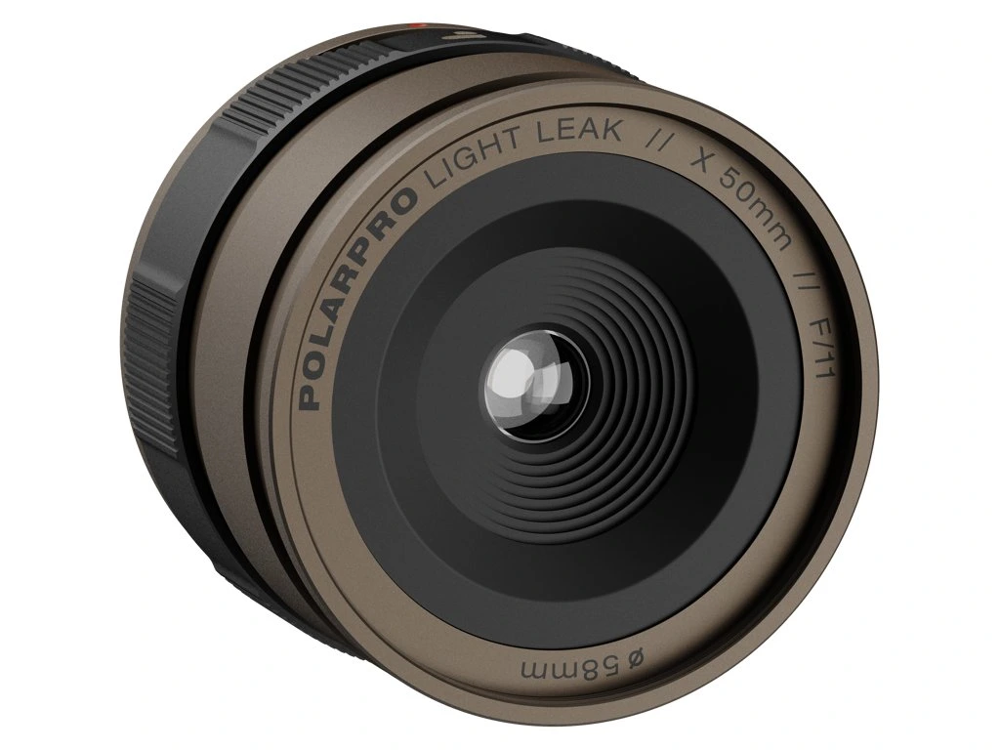
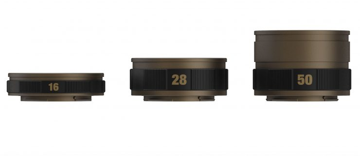

A **fully manual** PolarPro lens that deliberately admits light from the side — similar to **light leaks** on analogue **35 mm** film. Light enters around the optics (the barrel has openings); you dial the effect with a **rotating ring**.

## Links

- **Official product** — [LightLeak Lens – PolarPro](https://www.polarpro.com/products/lightleak-lens)
- **FAQ** — [PolarPro Zendesk – LightLeak Lenses](https://polarpro.zendesk.com/hc/en-us/articles/28041431360283-FAQ-LightLeak-Lenses)
- **Czech retailer** — [Fujifoto – PolarPro LightLeak](https://www.fujifoto.cz/vyhledavani/?string=PolarPro+LightLeak) (search results)
- **See also** — [Filters](/photography/accessories/filters/) (screw-in ND/CPL notes), [Camera gear](/photography/accessories/camera-gear/)

## Focal lengths and look

| Focal length | Character (per manufacturer) |
|--------------|------------------------------|
| **16 mm** | Small sharp centre, strong fall-off toward the edges |
| **28 mm** | Closest to a disposable-camera look; soft edges |
| **50 mm** | Larger sharp centre, better for portraits / more distant subjects |

Also sold as a **3-pack** (16 + 28 + 50 mm).

**Crop (APS-C):** PolarPro lists focal lengths as **full-frame**; on crop (e.g. Fuji X) a 28 mm will feel closer to about a **42 mm** equivalent.

## Mounts and filter thread

| Mount | Filter thread |
|-------|----------------|
| Canon RF | 67 mm (not **EF**) |
| Sony E | 58 mm |
| Fujifilm X | 58 mm |
| Nikon Z | 67 mm |
| Leica L | 67 mm |

## Technical notes

- **Aperture:** fixed **f/11**
- **Focus:** from about **1 m** to infinity (no AF — point-and-shoot style)
- **Barrel:** aluminium
- **Stills and video:** yes; leak strength depends on angle to the light, ring position, and camera placement (see manufacturer FAQ)

In the box: lens, front and rear caps.
