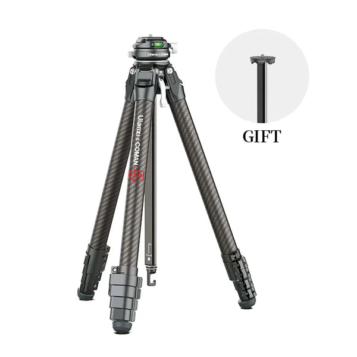

Monopods and full-size / travel tripods. **Mini / tabletop:** [Mini Tripods](/photography/accessories/mini-tripods/).

### [iFootage Cobra 3](https://eu.ifootagegear.com/products/cobra-3-strike-monopod)

**Cobra 3 Strike** (incl. EU shop): one-touch leg extension, pedal foot with quick reset, quick-release collar, tilt up to ~130° with base. Line also includes other trims (e.g. carbon variants); confirm exact model on the invoice.

| | Monopod only | With folding base |
|--|--|--|
| Folded length | ~71.5 cm | ~83.7 cm (Base-P) |
| Extended height | ~138 cm | ~150 cm |
| Weight | ~1.0 kg | ~1.45–1.6 kg (base variant) |
| Payload (listed) | — | **5 kg** (official EU spec for A150S-III aluminium series) |

Older marketing URLs (e.g. “Original version”) may 404 — use the regional store or [global product hub](https://ifootagegear.com/products/cobra3strikemonopod).

### [Benro Theta](https://www.benro.com/en/campaign/theta.html)

Travel tripod with **motorised auto-levelling** (optional modules: battery / camera control / GoLive streaming / optical matrix for timelapse exposure assist). Carbon legs, aluminium ball head; dual ball + pan/tilt video modes; Auto-Lock QR plate.

| | Theta | Theta MAX |
|--|--|--|
| Max payload | 11 kg | 20 kg |
| Packed length (incl. head) | 44 cm | 53 cm |
| Packed diameter (max) | 7.2 cm | 7.9 cm |
| Max height (column up) | 155 cm | — |
| Max height (column down / spec) | 120 cm | 170 cm (no column up) |
| Leg sections | 5 | 5 |
| Leg angles | 20° / 55° / 80° | same |
| Levelling tolerance | 0.1° | 0.1° |

[Product / store](https://www.benro.com/en/product/benro-theta.html) — pricing and modules change with retail promos.

## Budget travel tripods (under $100)

- **[NEEWER LITETRIP LT07](https://www.amazon.com/NEEWER-LITETRIP-Aluminum-Profile-Compatible/dp/B0D1V6YF98)** — 61" aluminium travel tripod with pan/tilt low-profile ball head, Arca-compatible plate, and phone holder.
- **[Freewell Real Travel Tripod](https://www.freewellgear.com/en/tripod/1228-the-real-travel-tripod.html)** — ultra-compact lightweight travel tripod with 360 ball head.

### Ulanzi Zero F38 travel tripod

**[Ulanzi Zero F38 Quick Release Travel Tripod (3131)](https://www.ulanzi.com/products/ulanzi-f38-quick-release-travel-tripod-3131)** — **carbon fibre** travel legs with a **built-in ball head** that uses the **Falcam F38** quick-release (not a generic Arca clamp on the integrated head). Ulanzi ships an **extra centre column** so you can fit a separate **Arca-Swiss** head if you replace the column/head assembly yourself (Arca head not in the base box).

| | Zero F38 (vendor listing) |
|--|--|
| Folded length | ~**42.3 cm** |
| Max height | ~**159 cm** |
| Weight | ~**1.1 kg** |
| Load (claimed) | ~**18 kg** |
| Leg sections | **5**; leg angles **20° / 55° / 75°** |
| Head | Integrated **F38** ball head (not user-detachable per FAQ); **removable short column** for low angles |

**Bundles:** same product page often sells add-ons (**backpack clip**, **shoulder strap F38 mount**, **Peak Design–compatible plate**) — see [Straps](/photography/accessories/straps/) for the shoulder QR kit.

**Practically:** premium **travel** size, but **F38-only** on the stock head; ideal if you already committed to **F38** plates across tripod, clip, and strap. If you need **Kirk L-bracket / generic Arca** on the built-in head only, read Ulanzi’s FAQ: use the spare column with your own Arca head instead.
